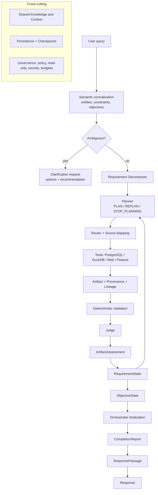

# Baseball Agent

Latest work (2026-09-18): **HYBRID_SEMANTIC_LAYER_READY — READY_FOR_CODEX_REVIEW** on
`pi/v0.1-llm-semantic-parser`, branched from
`codex/v0.1-semantic-recheck @ eae9875e86632f509b0351ea31da040ef151bc7e`.
[Implementation report](docs/reviews/v01-hybrid-semantic-layer.md). 473 tests pass with no
skips; the original blocker gate, the Codex NL-to-SQL trace and the new hybrid semantic
gate all exit 0. This is a review candidate, not adoption or release approval: `main` is
untouched and no tag exists. Live LLM extraction is `UNVERIFIED_LIVE` here.

The prior independent verdict remains the authoritative blocked baseline until Codex
re-reviews this branch:

Current independent verdict (2026-09-17): **FINAL_REVIEW_BLOCKED** on
`codex/v0.1-semantic-recheck`. [Semantic re-review](docs/reviews/v01-semantic-recheck.md)
records the remaining five compositional failures, regression-backed fixes, and live evidence.
Baseline: 432 tests; corrected review: 435 tests, no skips. The original blocker gate
passes, but the expanded NL-to-SQL release gate fails. No main adoption or tag is authorized
while those P1 defects remain. Repair-checkpoint claims below are not release approval.

An explainable, verifiable MLB analytics agent. It turns a natural-language baseball
question into a set of analysis objectives, decomposes them into information
requirements, plans and routes work to data sources, validates and judges the results,
tracks requirement/objective state, and produces a sourced answer with explicit
limitations.

The architecture is **frozen** (blog decisions D001–D066). This repository is the working
implementation: a deterministic vertical slice with a passing regression suite with provider-agnostic LLM
seams. See [docs/blog-implementation-matrix.md](docs/blog-implementation-matrix.md) for
exactly which blog decisions are implemented.

## What it does today

- **Semantic normalization** — entity resolution with aliases/nicknames, clarification on
  ambiguity, constraint authority, and objective extraction (no re-parsing of intent by
  the Planner).
- **Hybrid semantic parsing** — a constrained LLM (or deterministic) extractor proposes a
  closed, typed, provenance-carrying `SemanticCandidate`; a deterministic validator is the
  authority that grounds evidence, blocks numeric cross-binding and contradictions, and
  fails closed or clarifies instead of executing a weaker interpretation. Includes exact
  compound count states (`0-2 or 1-1` is `{(0,2),(1,1)}`). See
  [ADR 0021](docs/adr/0021-constrained-hybrid-semantic-parsing.md).
- **Requirement decomposition** — a narrow Requirement Decomposer turns an objective into
  semantic-atomic, immutable Initial Requirements.
- **Planning** — a Planner that returns `PLAN` / `REPLAN` / `STOP_PLANNING` with a
  terminal latch that prevents infinite loops.
- **Routing** — a narrow Router with the mandated precedence
  (System Policy > User Constraint > Capability/Source Mapping > Planner Preference >
  Optimization), plus Source Mapping execution (DIRECT / CALCULATED / NO_MAPPING).
- **Deterministic validation + Judge** — hard failures (wrong entity, missing schema,
  integrity, time-range) cannot be overridden; soft signals (sample, coverage, freshness)
  are interpreted contextually.
- **Contextual assessment and state** — `ArtifactAssessment`, `RequirementState`,
  `ObjectiveState` as separate runtime projections.
- **Persistence and checkpoint/resume** — operational store, artifact payload storage,
  checkpoints and idempotent resume that reuses artifacts.
- **Provenance and lineage** — every artifact records where it came from; a Feature Engine
  emits derived metric artifacts with `derived_from` lineage.
- **Provider-agnostic LLM seams** — Planner, Judge and Response have deterministic
  implementations and LLM implementations behind the same Protocols.
- **Read-only safety** — an AST-based SQL guard validated before any connection, a
  read-only PostgreSQL transaction, a DuckDB path sandbox, and a redacted result contract.
- **Typed analytical constraints** — two-strike count (exact counts stay exact), pitch
  velocity (distinct from exit velocity), pitch family (fastball → explicit FF/SI/FC/FA
  codes), upper-zone location definitions, ranking intent with explicit aggregation, an
  explicit game-type/event population, and a frozen qualification threshold are typed, not
  opaque strings, and flow from the query into the Planner without leaking physical column
  names.
- **Semantic/physical separation** — semantic keys (`pitch_velocity`, `exit_velocity`,
  `pitch_type`, `count`, `pitch_location`, `batter`) map to physical columns
  (`release_speed`, `launch_speed`, `zone`, `strikes`, …) only in the deterministic
  `FieldMappingRegistry` + read-only adapters, never in the Planner.
- **Real read-only Statcast adapters** — `ParquetStatcastTool` (DuckDB) and
  `PostgresStatcastTool` (read-only PostgreSQL) build one validated read-only query from
  the semantic descriptor and typed constraints, returning an `Artifact` with provenance.
- **Shared Knowledge base** — a persistent, sourced, versioned MLB domain knowledge base
  (rules, transactions, bilingual glossary and metrics, all 30 teams, ballparks, players,
  awards, trusted sources and the community directory) behind `ContextService`.

Status: **FINAL_REVIEW_BLOCKED** on
`pi/v0.1-semantic-fixes`. The independent review's four analytics blockers are repaired:
explicit pitch/exit-velocity filters, explicit AVG/MAX aggregation and exact counts are
preserved; the qualification threshold is frozen; the game-type and batted-ball
population is explicit; and Statcast zones 11-12 are described as upper outside
quadrants. See [the final review](docs/reviews/v01-final-review.md) for the blocked
baseline and [the population ADR](docs/adr/0020-analytical-population-and-qualification.md)
for the contract. Shared Knowledge and the hardened runtime are integrated. Definition
questions use stored knowledge; synthetic analytics requires `--demo`. The real analytics
vertical slice runs end to end against the historical Parquet archive and live PostgreSQL
(typed two-strike / fastball / pitch-velocity / upper-zone constraints + exit-velocity
ranking + explicit population/qualification). See tested commands, live results, and
remaining gaps in [v0.1 validation](docs/usage/v01-validation.md).

## Architecture



Layers are responsibilities, not deployed services. See
[docs/development/architecture.md](docs/development/architecture.md).

## Install

Requires Python 3.11+ (developed on 3.14).

```bash
git clone https://github.com/CityuHK-wyj/baseball_agent.git
cd baseball_agent
python3 -m venv .venv
source .venv/bin/activate
pip install -r requirements.txt
```

## Configure

Configuration is read from environment variables at process start; Python does **not**
load `.env` automatically. Copy the template and fill it in, or export variables yourself.

```bash
cp .env.example .env
# edit .env, or export variables in your shell
```

Nothing is required for the offline CLI. See
[docs/usage/configuration.md](docs/usage/configuration.md) for every variable.

## Run

```bash
# A sourced definition from local Shared Knowledge
python3 -m app.cli ask "DFA是什么意思？" --persist --json

# Explicit synthetic demonstration (not a real performance result)
python3 -m app.cli ask "How did Aaron Judge perform at the plate?" --demo

# Shared Knowledge: inspect, search and refresh the domain knowledge base
python3 -m app.cli knowledge status
python3 -m app.cli knowledge search "DFA"
python3 -m app.cli knowledge show TEAM:LAD

# Reproduce persisted ask/answer/inspect/resume/metrics in a temporary directory
python3 scripts/verify_v01_workflows.py
```

See [docs/usage/quickstart.md](docs/usage/quickstart.md),
[docs/usage/knowledge-base.md](docs/usage/knowledge-base.md) and
[docs/usage/examples.md](docs/usage/examples.md).

## Test

```bash
python3 -m unittest discover -s tests -q
python3 scripts/secret_scan.py             # credential tripwire (exit 0 = clean)
python3 -m compileall -q app tests scripts
```

## Shared Knowledge

Shared Knowledge is a persistent MLB domain knowledge base — rules, transactions, a
bilingual glossary and metric definitions, all 30 current teams and ballparks, notable
player identities, awards, trusted sources and community creators. It is a capability,
not a retrieval agent.

Physical layout:

- code: `app/knowledge/` (store, ingestion, refresh, retrieval, service) and
  `app/context/knowledge_source.py`;
- persistent store: SQLite at `.runtime/knowledge.db` locally, or the PostgreSQL
  `knowledge` schema in production (separate from `baseball_analytics`);
- runtime artifact: the `.db` file, never committed and rebuildable;
- source manifests: `knowledge/sources/*.json`; structured seed: `knowledge/seed/*.json`.

```bash
python3 -m app.cli knowledge status
python3 -m app.cli knowledge search "infield fly"
python3 -m app.cli knowledge show PLAYER:660271
python3 -m app.cli knowledge sources --community
```

See [docs/usage/knowledge-base.md](docs/usage/knowledge-base.md),
[docs/development/shared-knowledge.md](docs/development/shared-knowledge.md) and
[ADR 0019](docs/adr/0019-shared-knowledge-base.md).

## Security boundaries

- Baseball analytics (PostgreSQL, DuckDB/Parquet) is **read-only** for the runtime. SQL is
  parsed and rejected before any connection; PostgreSQL runs in a read-only transaction.
- Agent runtime data lives in a **separate** operational store, never in the analytics DB.
- Secrets come only from the environment and are redacted from every error and metric.
- See [docs/usage/security.md](docs/usage/security.md).

## Project layout

```
app/
  semantic/      entity resolution, objectives, requirement decomposition, registries,
                 typed analytical intent + semantic/physical field mapping
  models/        domain contracts (definitions and runtime state, including knowledge)
  knowledge/     persistent Shared Knowledge store, ingestion, refresh and retrieval
  agent/         planner, router, source mapping, executor, orchestrator, response, review
  assessment/    deterministic validator, judge, adequacy rules
  context/       Shared Context retrieval (not an agent)
  persistence/   operational store, artifact storage, recorder, resume, checkpoints
  tools/         guarded read-only execution, results, real Statcast adapters, synthetic source
  features/      deterministic Feature Engine
  llm/           provider abstraction, prompts, LLM planner/judge/response
  observability/ redacted events and evaluation metrics
  validation/    SQL guard, policy, permissions
  pipeline.py    end-to-end composition
  cli.py         command-line interface
knowledge/
  sources/       committed source manifests (authority, refresh policy, best_for)
  seed/          committed structured knowledge packs (reference, rules, glossary, players, community)
docs/
  adr/           architecture decision records
  usage/         how to install, configure, run, extend
  development/   architecture and extension guides
  blog-implementation-matrix.md
  development-status.md
  codex-handoff.md
```

## Status and limitations

`IN_PROGRESS — stable checkpoint`. Both the historical Parquet archive (2015–2023) and the
live analytical PostgreSQL database (2024-03-15…2026-09-14) are `LIVE_VERIFIED` through
the real read-only analytics path: the target two-strike, fastball ≥ 95 mph, upper-zone,
top-5 exit-velocity query returns real rows with provenance and no synthetic fallback.
Both sources now retain `sz_top`/`sz_bot`/`p_throws`, so the exact batter-relative upper
edge (`plate_z >= sz_top - 0.25 ft`) is `EXACTLY_SUPPORTED` on historical Parquet and recent
PostgreSQL (the corrected zone-based upper third is zones 1-3). PostgreSQL is strictly
read-only (`SELECT` only; writes denied). Batter names resolve from `player_dictionary`
(100% of distinct PostgreSQL batters). MLB
StatsAPI returned 30 teams once; later network attempts failed. Current-data analytics and
live Web evidence remain `UNVERIFIED_LIVE`. RAG and pgvector remain deferred. See
[docs/development-status.md](docs/development-status.md) and the
[capability matrix](docs/development/analytics-capability-matrix.md).

# Date planning checkpoint

The default pipeline freezes `近30天` / `last 30 days`, single calendar years and ISO
date ranges before execution, preserving them across resume (now also in the real analytics
path). Multi-window date comparison (`2023 vs 2024`, recent vs previous period) still fails
closed pending date clarification support; see
[validation status](docs/usage/v01-validation.md).
