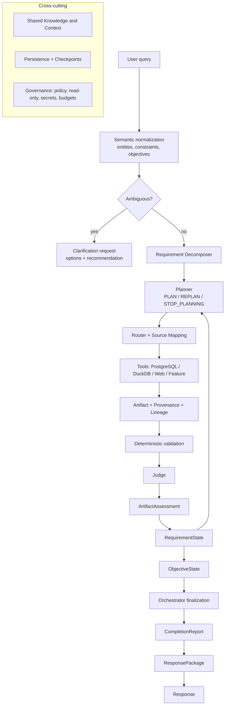

# Baseball Agent

An explainable, verifiable MLB analytics agent. It turns a natural-language baseball
question into a set of analysis objectives, decomposes them into information
requirements, plans and routes work to data sources, validates and judges the results,
tracks requirement/objective state, and produces a sourced answer with explicit
limitations.

The architecture is **frozen** (blog decisions D001–D066). This repository is the working
implementation: a deterministic, fully tested vertical slice with provider-agnostic LLM
seams. See [docs/blog-implementation-matrix.md](docs/blog-implementation-matrix.md) for
exactly which blog decisions are implemented.

## What it does today

- **Semantic normalization** — entity resolution with aliases/nicknames, clarification on
  ambiguity, constraint authority, and objective extraction (no re-parsing of intent by
  the Planner).
- **Requirement decomposition** — a narrow Requirement Decomposer turns an objective into
  semantic-atomic, immutable Initial Requirements.
- **Planning** — a Planner that returns `PLAN` / `REPLAN` / `STOP_PLANNING` with a
  terminal latch that prevents infinite loops.
- **Routing** — a narrow Router with the mandated precedence
  (System Policy > User Constraint > Capability/Source Mapping > Planner Preference >
  Optimization), plus Source Mapping execution (DIRECT / CALCULATED / NO_MAPPING).
- **Deterministic validation + Judge** — hard failures (wrong entity, missing schema,
  integrity, time-range) cannot be overridden; soft signals (sample, coverage, freshness)
  are interpreted contextually.
- **Contextual assessment and state** — `ArtifactAssessment`, `RequirementState`,
  `ObjectiveState` as separate runtime projections.
- **Persistence and checkpoint/resume** — operational store, artifact payload storage,
  checkpoints and idempotent resume that reuses artifacts.
- **Provenance and lineage** — every artifact records where it came from; a Feature Engine
  emits derived metric artifacts with `derived_from` lineage.
- **Provider-agnostic LLM seams** — Planner, Judge and Response have deterministic
  implementations and LLM implementations behind the same Protocols.
- **Read-only safety** — an AST-based SQL guard validated before any connection, a
  read-only PostgreSQL transaction, a DuckDB path sandbox, and a redacted result contract.
- **Shared Knowledge base** — a persistent, sourced, versioned MLB domain knowledge base
  (rules, transactions, bilingual glossary and metrics, all 30 teams, ballparks, players,
  awards, trusted sources and the community directory) behind `ContextService`.

Not yet implemented: live PostgreSQL/Parquet integration tests, a live web provider,
and durable metrics. RAG and pgvector are deferred; structured Shared Knowledge is implemented.

## Architecture



Layers are responsibilities, not deployed services. See
[docs/development/architecture.md](docs/development/architecture.md).

## Install

Requires Python 3.11+ (developed on 3.14).

```bash
git clone https://github.com/CityuHK-wyj/baseball_agent.git
cd baseball_agent
python3 -m venv .venv
source .venv/bin/activate
pip install -r requirements.txt
```

## Configure

Configuration is read from environment variables at process start; Python does **not**
load `.env` automatically. Copy the template and fill it in, or export variables yourself.

```bash
cp .env.example .env
# edit .env, or export variables in your shell
```

Nothing is required for the offline CLI. See
[docs/usage/configuration.md](docs/usage/configuration.md) for every variable.

## Run

```bash
# One question, offline (synthetic data source, no database or credentials)
python3 -m app.cli ask "How did Aaron Judge perform at the plate?"

# Shared Knowledge: inspect, search and refresh the domain knowledge base
python3 -m app.cli knowledge --seed status
python3 -m app.cli knowledge search "DFA"
python3 -m app.cli knowledge show TEAM:LAD
python3 -m app.cli knowledge refresh teams

# Persist a run and inspect it
python3 -m app.cli ask "How did Aaron Judge perform?" --persist
python3 -m app.cli inspect --run-id run-1
python3 -m app.cli resume --run-id run-1
python3 -m app.cli metrics --run-id run-1
```

See [docs/usage/quickstart.md](docs/usage/quickstart.md),
[docs/usage/knowledge-base.md](docs/usage/knowledge-base.md) and
[docs/usage/examples.md](docs/usage/examples.md).

## Test

```bash
python3 -m unittest discover -s tests -v   # 254 tests (audit branch, 2026-09-15)
python3 scripts/secret_scan.py             # credential tripwire (exit 0 = clean)
python3 -m compileall app                  # byte-compile check
```

## Shared Knowledge

Shared Knowledge is a persistent MLB domain knowledge base — rules, transactions, a
bilingual glossary and metric definitions, all 30 current teams and ballparks, notable
player identities, awards, trusted sources and community creators. It is a capability,
not a retrieval agent.

Physical layout:

- code: `app/knowledge/` (store, ingestion, refresh, retrieval, service) and
  `app/context/knowledge_source.py`;
- persistent store: SQLite at `.runtime/knowledge.db` locally, or the PostgreSQL
  `knowledge` schema in production (separate from `baseball_analytics`);
- runtime artifact: the `.db` file, never committed and rebuildable;
- source manifests: `knowledge/sources/*.json`; structured seed: `knowledge/seed/*.json`.

```bash
python3 -m app.cli knowledge --seed status
python3 -m app.cli knowledge search "infield fly"
python3 -m app.cli knowledge show PLAYER:660271
python3 -m app.cli knowledge sources --community
```

See [docs/usage/knowledge-base.md](docs/usage/knowledge-base.md),
[docs/development/shared-knowledge.md](docs/development/shared-knowledge.md) and
[ADR 0019](docs/adr/0019-shared-knowledge-base.md).

## Security boundaries

- Baseball analytics (PostgreSQL, DuckDB/Parquet) is **read-only** for the runtime. SQL is
  parsed and rejected before any connection; PostgreSQL runs in a read-only transaction.
- Agent runtime data lives in a **separate** operational store, never in the analytics DB.
- Secrets come only from the environment and are redacted from every error and metric.
- See [docs/usage/security.md](docs/usage/security.md).

## Project layout

```
app/
  semantic/      entity resolution, objectives, requirement decomposition, registries
  models/        domain contracts (definitions and runtime state, including knowledge)
  knowledge/     persistent Shared Knowledge store, ingestion, refresh and retrieval
  agent/         planner, router, source mapping, executor, orchestrator, response, review
  assessment/    deterministic validator, judge, adequacy rules
  context/       Shared Context retrieval (not an agent)
  persistence/   operational store, artifact storage, recorder, resume, checkpoints
  tools/         guarded read-only execution, results, synthetic source
  features/      deterministic Feature Engine
  llm/           provider abstraction, prompts, LLM planner/judge/response
  observability/ redacted events and evaluation metrics
  validation/    SQL guard, policy, permissions
  pipeline.py    end-to-end composition
  cli.py         command-line interface
knowledge/
  sources/       committed source manifests (authority, refresh policy, best_for)
  seed/          committed structured knowledge packs (reference, rules, glossary, players, community)
docs/
  adr/           architecture decision records
  usage/         how to install, configure, run, extend
  development/   architecture and extension guides
  blog-implementation-matrix.md
  development-status.md
  codex-handoff.md
```

## Status and limitations

`IN_PROGRESS`. The deterministic vertical slice is complete and tested; several
integrations (live databases, Web evidence, RAG) are stubs or absent and are listed in
[docs/blog-implementation-matrix.md](docs/blog-implementation-matrix.md). No live
database or LLM call has been verified from this repository. See
[docs/development-status.md](docs/development-status.md).
