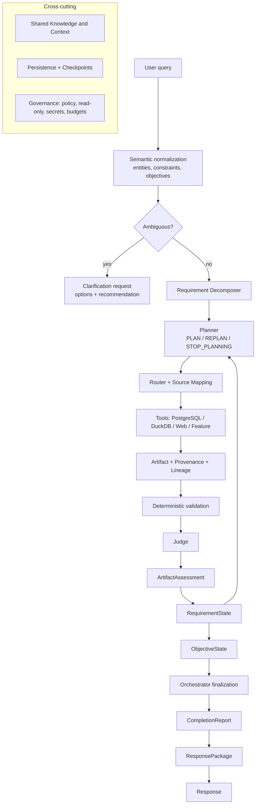

# Baseball Agent

**v0.1.0 — Dual Semantic Runtime.** An explainable, verifiable MLB analytics agent. It
turns a natural-language baseball question into a set of analysis objectives, decomposes
them into information requirements, plans and routes work to data sources, validates and
judges the results, tracks requirement/objective state, and produces a sourced answer with
explicit limitations.

The architecture is **frozen** (blog decisions D001–D066). This repository is the working
implementation: a deterministic vertical slice with a passing regression suite and
provider-agnostic LLM seams. See
[docs/blog-implementation-matrix.md](docs/blog-implementation-matrix.md) for exactly which
blog decisions are implemented.

**New to the project? Start with [docs/usage.md](docs/usage.md)** — it covers activation,
required variables, database requirements, runnable commands, reading the output, trace
mode and tests.

```bash
source /root/.virtualenvs/baseball_agent/bin/activate
export DEEPSEEK_API_KEY='<your API key>'
export POSTGRES_PASSWORD='<baseball_readonly password>'
python3 scripts/smoke_test.py                       # non-destructive PASS/WARN/FAIL preflight
python3 -m app.cli ask "DFA是什么意思？"              # knowledge question
python3 -m app.cli ask "top 5 by maximum exit velocity on fastballs at least 95 mph with at least 20 BBE in 2025" --trace
```

## What it does today

- **Semantic normalization** — entity resolution with aliases/nicknames, clarification on
  ambiguity, constraint authority, and objective extraction (no re-parsing of intent by
  the Planner).
- **Dual semantic parsing** — a constrained extractor LLM proposes a closed, typed,
  provenance-carrying `SemanticCandidate`; an independent reviewer LLM reconstructs the
  meaning *without seeing the extractor's candidate*; a deterministic `SemanticReconciler`
  compares both against narrow lexical anchors; and the deterministic validator is the
  final authority. Material disagreement or ambiguity becomes a Clarification instead of
  executing a maybe-wrong interpretation. No single model may both propose and approve
  meaning. Includes exact compound count states (`0-2 or 1-1` is `{(0,2),(1,1)}`), explicit
  population precedence and fail-safe provider-failure handling. See
  [ADR 0021](docs/adr/0021-constrained-hybrid-semantic-parsing.md) and
  [ADR 0022](docs/adr/0022-dual-semantic-runtime.md).
- **Requirement decomposition** — a narrow Requirement Decomposer turns an objective into
  semantic-atomic, immutable Initial Requirements.
- **Planning** — a Planner that returns `PLAN` / `REPLAN` / `STOP_PLANNING` with a
  terminal latch that prevents infinite loops.
- **Routing** — a narrow Router with the mandated precedence
  (System Policy > User Constraint > Capability/Source Mapping > Planner Preference >
  Optimization), plus Source Mapping execution (DIRECT / CALCULATED / NO_MAPPING).
- **Deterministic validation + Judge** — hard failures (wrong entity, missing schema,
  integrity, time-range) cannot be overridden; soft signals (sample, coverage, freshness)
  are interpreted contextually.
- **Contextual assessment and state** — `ArtifactAssessment`, `RequirementState`,
  `ObjectiveState` as separate runtime projections.
- **Persistence and checkpoint/resume** — operational store, artifact payload storage,
  checkpoints and idempotent resume that reuses artifacts.
- **Provenance and lineage** — every artifact records where it came from; a Feature Engine
  emits derived metric artifacts with `derived_from` lineage.
- **Provider-agnostic LLM seams** — Planner, Judge and Response have deterministic
  implementations and LLM implementations behind the same Protocols.
- **Read-only safety** — an AST-based SQL guard validated before any connection, a
  read-only PostgreSQL transaction, a DuckDB path sandbox, and a redacted result contract.
- **Typed analytical constraints** — two-strike count (exact counts stay exact), pitch
  velocity (distinct from exit velocity), pitch family (fastball → explicit FF/SI/FC/FA
  codes), upper-zone location definitions, ranking intent with explicit aggregation, an
  explicit game-type/event population, and a frozen qualification threshold are typed, not
  opaque strings, and flow from the query into the Planner without leaking physical column
  names.
- **Semantic/physical separation** — semantic keys (`pitch_velocity`, `exit_velocity`,
  `pitch_type`, `count`, `pitch_location`, `batter`) map to physical columns
  (`release_speed`, `launch_speed`, `zone`, `strikes`, …) only in the deterministic
  `FieldMappingRegistry` + read-only adapters, never in the Planner.
- **Real read-only Statcast adapters** — `ParquetStatcastTool` (DuckDB) and
  `PostgresStatcastTool` (read-only PostgreSQL) build one validated read-only query from
  the semantic descriptor and typed constraints, returning an `Artifact` with provenance.
- **Shared Knowledge base** — a persistent, sourced, versioned MLB domain knowledge base
  (rules, transactions, bilingual glossary and metrics, all 30 teams, ballparks, players,
  awards, trusted sources and the community directory) behind `ContextService`.

Status: **v0.1.0 RELEASED — DUAL_SEMANTIC_RUNTIME**. The dual semantic runtime is
integrated: independent extractor and reviewer roles, a first-class `SemanticReconciler`,
narrow lexical anchors, a deterministic validator and durable review reuse. The nine
demonstrated adversarial containment failures now clarify or reject instead of reaching
SQL, and all previously repaired compositional blockers remain repaired. Definition
questions use stored knowledge; synthetic analytics requires `--demo`. The real analytics
vertical slice runs end to end against the historical Parquet archive and live PostgreSQL
(typed two-strike / fastball / pitch-velocity / upper-zone constraints + exit-velocity
ranking + explicit population/qualification). See [docs/usage.md](docs/usage.md) for the
runnable commands and [the dual semantic review](docs/reviews/v01-dual-semantic-runtime.md)
for gate evidence and remaining gaps.

## Architecture



Layers are responsibilities, not deployed services. See
[docs/development/architecture.md](docs/development/architecture.md).

## Install

Requires Python 3.11+ (developed and verified on 3.14). In the current WSL environment the
environment already exists at `/root/.virtualenvs/baseball_agent`:

```bash
cd /home/158112/baseball_agent/baseball_agent
source /root/.virtualenvs/baseball_agent/bin/activate
```

Fresh checkout:

```bash
git clone https://github.com/CityuHK-wyj/baseball_agent.git
cd baseball_agent
python3 -m venv .venv
source .venv/bin/activate
pip install -r requirements.txt
```

## Configure

Configuration is read from environment variables at process start; Python does **not**
load `.env` automatically. Copy the template and fill it in, or export variables yourself.

```bash
cp .env.example .env
# edit .env, or export variables in your shell
```

Nothing is required for the offline CLI. See
[docs/usage/configuration.md](docs/usage/configuration.md) for every variable.

## Run

```bash
# Non-destructive preflight: config, PostgreSQL read-only identity, Parquet,
# knowledge store and model reachability
python3 scripts/smoke_test.py          # or: python3 -m app.cli doctor

# A sourced definition from local Shared Knowledge
python3 -m app.cli ask "DFA是什么意思？"

# Real analytics (PostgreSQL 2025) with a structured decision trace
python3 -m app.cli ask "top 5 by maximum exit velocity on fastballs at least 95 mph with at least 20 BBE in 2025" --trace

# Cross-source 2023 vs 2024
python3 -m app.cli ask "top 5 by maximum exit velocity in the regular season in 2023 vs 2024"

# Explicit synthetic demonstration (not a real performance result)
python3 -m app.cli ask "How did Aaron Judge perform at the plate?" --demo

# Shared Knowledge: inspect, search and refresh the domain knowledge base
python3 -m app.cli knowledge status
python3 -m app.cli knowledge search "DFA"
python3 -m app.cli knowledge show TEAM:LAD

# Reproduce persisted ask/answer/inspect/resume/metrics in a temporary directory
python3 scripts/verify_v01_workflows.py
```

Ambiguous analytics queries return a Clarification with options; resume them with
`python3 -m app.cli answer --run-id <run_id> --request-id <id> --choice <option>`. The full
walkthrough, output guide and trace mode are in **[docs/usage.md](docs/usage.md)**.
```

See [docs/usage/quickstart.md](docs/usage/quickstart.md),
[docs/usage/knowledge-base.md](docs/usage/knowledge-base.md) and
[docs/usage/examples.md](docs/usage/examples.md).

## Test

```bash
python3 -m unittest discover -s tests -q
python3 scripts/secret_scan.py             # credential tripwire (exit 0 = clean)
python3 -m compileall -q app tests scripts
```

## Shared Knowledge

Shared Knowledge is a persistent MLB domain knowledge base — rules, transactions, a
bilingual glossary and metric definitions, all 30 current teams and ballparks, notable
player identities, awards, trusted sources and community creators. It is a capability,
not a retrieval agent.

Physical layout:

- code: `app/knowledge/` (store, ingestion, refresh, retrieval, service) and
  `app/context/knowledge_source.py`;
- persistent store: SQLite at `.runtime/knowledge.db` locally, or the PostgreSQL
  `knowledge` schema in production (separate from `baseball_analytics`);
- runtime artifact: the `.db` file, never committed and rebuildable;
- source manifests: `knowledge/sources/*.json`; structured seed: `knowledge/seed/*.json`.

```bash
python3 -m app.cli knowledge status
python3 -m app.cli knowledge search "infield fly"
python3 -m app.cli knowledge show PLAYER:660271
python3 -m app.cli knowledge sources --community
```

See [docs/usage/knowledge-base.md](docs/usage/knowledge-base.md),
[docs/development/shared-knowledge.md](docs/development/shared-knowledge.md) and
[ADR 0019](docs/adr/0019-shared-knowledge-base.md).

## Security boundaries

- Baseball analytics (PostgreSQL, DuckDB/Parquet) is **read-only** for the runtime. SQL is
  parsed and rejected before any connection; PostgreSQL runs in a read-only transaction.
- Agent runtime data lives in a **separate** operational store, never in the analytics DB.
- Secrets come only from the environment and are redacted from every error and metric.
- See [docs/usage/security.md](docs/usage/security.md).

## Project layout

```
app/
  semantic/      entity resolution, objectives, requirement decomposition, registries,
                 typed analytical intent + semantic/physical field mapping
  models/        domain contracts (definitions and runtime state, including knowledge)
  knowledge/     persistent Shared Knowledge store, ingestion, refresh and retrieval
  agent/         planner, router, source mapping, executor, orchestrator, response, review
  assessment/    deterministic validator, judge, adequacy rules
  context/       Shared Context retrieval (not an agent)
  persistence/   operational store, artifact storage, recorder, resume, checkpoints
  tools/         guarded read-only execution, results, real Statcast adapters, synthetic source
  features/      deterministic Feature Engine
  llm/           provider abstraction, prompts, LLM planner/judge/response
  observability/ redacted events and evaluation metrics
  validation/    SQL guard, policy, permissions
  pipeline.py    end-to-end composition
  cli.py         command-line interface
knowledge/
  sources/       committed source manifests (authority, refresh policy, best_for)
  seed/          committed structured knowledge packs (reference, rules, glossary, players, community)
docs/
  adr/           architecture decision records
  usage/         how to install, configure, run, extend
  development/   architecture and extension guides
  blog-implementation-matrix.md
  development-status.md
  codex-handoff.md
```

## Status and limitations

`v0.1.0 RELEASED — DUAL_SEMANTIC_RUNTIME`. Both the historical Parquet archive
(2015–2023) and the live analytical PostgreSQL database (2024-03-15…2026-09-14) are
`LIVE_VERIFIED` through the real read-only analytics path. The dual semantic runtime runs
two independent DeepSeek calls (`deepseek-chat` by default) through the real `ModelProvider`
seam, reconciles them, and executes only anchor-consistent semantics. The narrow compound
query legitimately returns zero qualifying rows at the requested minimum 20 BBE and is
reported `FAILED`, never a false `COMPLETE`; a broader query returns real rows. PostgreSQL
is strictly read-only (`SELECT` only; writes denied) as `baseball_readonly`.

The full test suite, both adversarial gates, the dual reconciliation gate, `compileall`,
the secret scan, the doctor preflight and live PostgreSQL/Parquet/cross-source E2E are
recorded in [docs/reviews/v01-dual-semantic-runtime.md](docs/reviews/v01-dual-semantic-runtime.md).

Known limitations:

* The semantic vocabulary is closed and narrow (metrics `pitch_velocity` /
  `exit_velocity`; three upper-zone location definitions).
* Generalized temporal NLP, current-period comparisons and RAG/pgvector remain DEFERRED.
* Web Evidence and the separate Operational PostgreSQL control plane remain
  UNVERIFIED_LIVE.
* Report artifacts do not include pitch-grain reconciliation against upstream feeds.

Run `python3 scripts/smoke_test.py` before asking real questions; see
[docs/usage.md](docs/usage.md).
