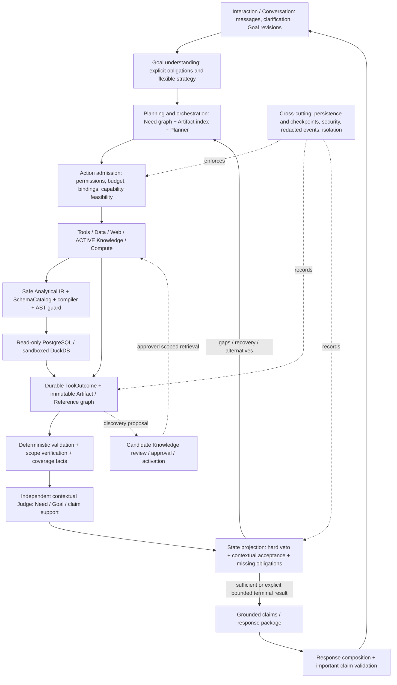

# Baseball Agent v0.3: full architecture and implementation review

## Executive summary

**Verdict: `ARCHITECTURE_REVIEW_CHANGES_REQUIRED`.** Do not merge this checkpoint on the strength of the current test suite or Stop Report.

Reviewed implementation: `pi/v0.3-artifact-runtime` at **`d7b75c6fa833d8b4e31c93d393879e026e4ff8e3`**. Review branch: `codex/v0.3-architecture-review`. `main` was `35b47c4174e98460ebdbcd2ace46adfba36225c4` before review. This review changes documentation only; it supplies no repair, production feature, test modification, merge, or tag.

The architecture direction is sound: flexible cognition, reusable evidence, deterministic privileged actions, contextual evaluation, and governed knowledge belong within the existing Interaction / Planning / Tools / Evaluation / Response architecture. v0.3 is a runtime correction within those layers. It should not replace the established security, persistence, governance, and assessment responsibilities with weaker parallel implementations.

The actual implementation is an **early Artifact-based execution substrate with a mostly precomputed task plan**, not the complete adaptive information runtime described in the Stop Report. It genuinely stores reusable exports, resolves some export references into tool inputs, compiles bounded analytical expressions, and assesses linked Needs after execution. These are material improvements over v0.2. But their semantic and operational contracts are not yet trustworthy enough for general completion claims.

The strongest parts are the existing guarded database executors, separation of runtime candidates from the authoritative knowledge store, explicit export/reference models, a useful initial analytical grammar, and the availability of deterministic test seams. The default route no longer requires a closed SemanticCandidate before planning. MetricRegistry is no longer the local analytical ceiling.

The most important weaknesses are:

1. **Truth of evidence scope is not established.** Scope is missing, synthetic, inferred from query parameters, or supplied by the caller. Coverage ignores game/event population and qualification, uses coarse lexical matching, and expressly exempts rosters from temporal checks. Wrong-scope results can satisfy core Needs.
2. **Independent semantic assessment is absent from the product factory.** CoverageJudge is invoked within the loop, but its optional independent hook is called only for PARTIAL results. SATISFIED results cannot be challenged by that hook. Goal completeness is computed over the Planner's own Need decomposition without independently checking that it covers the user's Goal.
3. **The action boundary has an unchecked identifier hole.** Selection aliases are interpolated as SQL text. An isolated probe inserted an additional expression through an alias and passed the read-only AST guard. Read-only enforcement remains valuable; it does not establish that SQL faithfully implements validated IR.
4. **Recovery often disappears from both planning and the displayed trace.** Several tool failures return no Artifact; these Needs receive no assessment, their recovery codes do not become coverage gaps, and `--trace` omits the steps that contain the error.
5. **Composition is partly nominal.** The scheduler attaches all matching conversation exports, rather than binding specific dependency outputs. Web records incoming DB lineage but does not use DB values to construct its query. Most planning occurs before outputs exist.
6. **Persistence regresses relative to the established architecture.** CLI construction supplies no store. Injected persistence saves an end-of-turn whole-conversation blob, suppresses errors, and restores stores without restoring identity counters. Subsequent writes can overwrite references or collide with Artifact IDs.

All **625 existing tests passed** during this review (`23.774s`, no skipped-test count reported). This is compatible with the defects above: only 59 tests exercise the new Artifact runtime, and several validate a reference's existence, generated SQL text, or status without testing the associated architectural promise. The read-only probes below demonstrate violations while the suite remains green.

### Evidence standard and limits

Source references below are relative to this report and refer to the exact implementation SHA, not subsequent code. `A` = implementation defect; `B` = architectural gap; `C` = missing capability. A limitation can have separate findings in different categories; lack of a provider capability is not itself permission to claim success.

Evidence is distinguished as **confirmed implementation behavior** (source inspection and, where stated, isolated reproduction), **confirmed displayed behavior reported by the user**, **strongly supported inference**, **missing evidence**, and **architectural recommendation**. The original manual run's complete ToolRequest/IR/recovery record was not found in the reviewed repository evidence or inspected existing operational stores/logs. Its exact local-analytics failure stage is **UNCONFIRMED / MISSING OBSERVABILITY EVIDENCE**. This report does not manufacture a failure code or equate a new reproduction with the original run.

The review read AGENTS.md, CONTEXT.md, ADRs 0001–0025, the architecture/Shared Knowledge guides, artifact-runtime documentation, the v0.2 audit, v0.3 Stop Report and reproduction/live harnesses, all five v0.3 test modules and their harness/fakes, and the runtime, tool, assessment, security, knowledge, persistence, conversation, response, and legacy wiring referenced below. The full suite was executed unchanged. Existing live evidence was inspected; no new live LLM/provider dogfood session was run. The isolated diagnostics used in-memory objects/fakes and compiler/guard calls, not privileged production execution.

## Intended vs actual architecture

| Area | Intended architecture | Actual checkpoint |
|---|---|---|
| Interaction | Conversation retains semantic/runtime state and clarification decisions | Engine owns conversation; `app/conversation/service.py` remains a placeholder; CLI starts a fresh in-memory session |
| Goal understanding | Raw user intent remains authoritative, explicit constraints persist | Semantic LLM produces brief; constraints become strings and USER_SPAN references without validated offsets; malformed time can become absent |
| Planning | Evidence-driven strategy, Need graph, explicit reuse, recovery | LLM creates initial Needs; deterministic scheduler executes named tools; LLM may add new Needs only after scheduler exhaustion and nonempty textual gaps |
| Tools | Capabilities truthfully describe scope and inputs | Contracts contain name, accepts/produces strings, description, cost; no historical/population/availability contract; cost unused |
| Artifacts | Immutable reusable products with verifiable scope and typed exports | Frozen outer models, mutable nested dicts/lists; `Any` exports; inconsistent provenance/lineage; no verification record |
| Evaluation | Deterministic facts plus independent contextual Judge drive re-planning | Scope scorer chooses one best Artifact per Need; no independent Judge in factory; optional hook cannot inspect SATISFIED evidence |
| Sufficiency | User Goal's core obligations supported, independently checked | All Planner-declared CORE Needs SATISFIED; Goal scope/constraint completeness not independently enforced |
| Response | Claims grounded through accepted evidence to originals | Claim is first few lines of selected Artifact; LLM produces unchecked final prose; support validation helpers unwired |
| Knowledge | Evidence → candidate → review → approved/ACTIVE, scoped retrieval | Candidate store separated; promotion exists, but candidate detail is thin, scope/type distinctions collapse, search also includes HISTORICAL |
| Persistence | Independent immutable products, journal, checkpoint, safe resume | Optional single snapshot at session start/end or clarification; no product-path execution journal; restore identity defects |
| Security | IR and schema correctness + SQL AST/read-only + permissions/budgets | Database protections reused; aliases bypass IR expression restriction; old permission/router and cost budgets not connected |
| Observability | Durable structured requests, outcomes, evaluations and terminal causes | Request decisions and end snapshots; tool errors in strings omitted from CLI; old redacted RunMetrics not wired |

ADRs 0001/0002/0007/0009/0018 established contextual assessment, immutable definitions/products, ordered persistence and source-to-evidence extraction. ADRs 0023–0025 intentionally relax cognition, but do not justify losing those responsibilities. ADR 0025 and `docs/artifact-runtime.md` themselves depict sufficiency largely after re-planning, whereas their prose describes per-execution assessment. The next architectural decision must resolve that ambiguity explicitly: an independent feedback assessment must precede each evidence-dependent planning decision.

## Runtime walkthrough

Primary code: [CLI](../../../app/cli.py), [factory](../../../app/artifact_runtime/factory.py), [engine](../../../app/artifact_runtime/engine.py), [planner](../../../app/artifact_runtime/planner.py), [tool contracts](../../../app/artifact_runtime/tool_base.py), [models](../../../app/models/artifact_runtime.py).

### Actual runtime sequence

```mermaid
sequenceDiagram
    participant U as User / CLI
    participant E as ArtifactRuntime
    participant S as SemanticInterpreter
    participant P as LLMPlanner
    participant D as Deterministic scheduler
    participant T as RuntimeTool
    participant X as IR compiler / guarded executor
    participant A as In-memory Artifact / Reference stores
    participant C as CoverageJudge
    participant R as Claims / Composer
    participant DB as Optional OperationalStore
    U->>E: start_conversation(); send_message(text)
    E->>A: USER_MESSAGE reference
    E->>S: message, recent history, dictionary matches, context
    S-->>E: SemanticBrief (LLM or rule fallback)
    alt Material clarification proposed
        E-->>U: WAITING_FOR_USER
        E->>DB: Optional whole snapshot; errors suppressed
    else New Goal
        E->>E: retain old Goal; clear Needs / assessments
        E->>P: initial_needs(Goal, brief, capability names, catalog)
        P-->>E: parsed Needs, or deterministic fallback Needs
        loop Up to six iterations
            E->>D: next_action(Needs, attempted pairs, all export hints)
            D-->>E: named ToolRequest or no action
            alt Request exists
                E->>E: append REQUEST_TOOL decision
                E->>T: run(request, context)
                opt local_analytics
                    T->>X: parse IR; resolve IDs; compile; execute guarded SQL
                    X-->>T: compilation result or ToolResult / rows
                end
                T->>A: add Artifact (many adapters do this themselves)
                T-->>E: ToolOutcome: Artifacts and/or recovery code
                E->>A: add missing Artifacts; register export references
                E->>E: link returned Artifacts; record recovery string
                E->>C: assess linked Need, then other linked Needs
                C-->>E: scope score / verdict; update Need status
            else No action
                E->>C: summarize assessments
                alt not complete and textual gaps exist
                    E->>P: add_needs(existing IDs, gap strings)
                    P-->>E: new Needs or empty
                end
            end
        end
        E->>C: refresh linked assessments; summarize
        E->>R: build_claims from SATISFIED assessments
        E->>E: COMPLETE / LIMITED / FAILED
        E->>R: compose from claims and selected evidence text
        R-->>U: response
        E->>DB: Optional whole snapshot; errors suppressed
    end
```

There is no default independent LLM Judge participant in this sequence. SQL security validation is at execution, not at Artifact acceptance. The old Orchestrator, AssessmentService, Router, state services, RunRecorder and ResumeService do not surround this new path.

### Transition ownership and truth

| Transition | Owner; input → output | Truth and logic | Persistence / failure behavior |
|---|---|---|---|
| CLI → session | `command_ask`/`command_chat`; text → conversation ID | Deterministic; new session each invocation | `_build_runtime` does not inject store; `--persist` is not forwarded here |
| Message → brief | `_turn`, interpreter; text/history → SemanticBrief | LLM with raw text, up to eight messages and active Goal statement; dictionary substring pre-resolution | Provider/parse errors fall back to limited temporal rule interpreter, without durable fallback event |
| Brief → Goal | `_new_goal`; brief → mutable Goal | Deterministic projection of model claims; string constraints referenced as selectors | In memory until turn ends; old Goal retained, old Need/assessment graph discarded |
| Goal → Needs | `initial_needs`, `_parse_needs` | LLM supplies objectives, criticality, scope, dependencies and IR; malformed scope silently becomes `None` | No validation that every explicit constraint is covered; no persisted plan checkpoint |
| Needs → request | `next_action`, `_build_request` | First ready Need, all dependencies SATISFIED, proposed tool not attempted for that Need | Request ID `req-{need_id}`; no retry of same pair; all matching exports appended, not dependency-specific bindings |
| Request → Tool | `_execute`, `ToolRegistry.get` | Named lookup, not `find_for`; constraints are strings most adapters ignore | Decision recorded before tool call; unknown name only adds a step; no general exception boundary |
| IR → SQL | `LocalAnalyticsTool`, compiler | Pydantic structure, catalog field lookup, deterministic SQL rendering | Some failures return diagnostic INVALID Artifact; earlier/later failures return no Artifact; unchecked aliases remain a gap |
| SQL → rows | read-only executors | Role, AST, table/path guard, bounded fetch; PostgreSQL read-only transaction | Structured ToolResult with redaction; adapter loses much status/retry/truncation detail |
| Rows → Artifact | individual adapter | Tool constructs payload, exports, confidence, declared actual scope | Usually inserted directly into shared in-memory store; payload/metadata consistency unverified |
| Artifact → refs | adapter plus `_add_artifacts` | ReferenceStore counters; export map | In memory, no durable Artifact-before-reference protocol in v0.3 |
| Artifact → acceptance | `_assess_need`, CoverageJudge | Best scope score among linked OK/PARTIAL Artifacts; Tool confidence used as quality | Replace previous assessment with same Need ID; no per-attempt history; no assessment if no linked Artifact |
| Assessment → next plan | Need status and `summarize` | Deterministic scheduler sees status; LLM add-needs sees IDs and gap strings only | Recovery codes/rows/ref hints not supplied to the LLM prompt; missing unassessed Needs can yield no textual gaps |
| Coverage → terminal | `_status_for` | All core assessed SATISFIED → COMPLETE; any linked OK/PARTIAL Artifact → LIMITED; else FAILED | No structured terminal reason or durable latch; LIMITED need not contain a supported claim |
| Acceptance → claims | `build_claims` | First three nonempty Artifact lines, bounded to 280 characters; references attached | Claims are not independently checked for entailment; not separately persisted |
| Claims → response | composer | Deterministic rendering or LLM prose over claim/evidence text | No final prose validation; LLM prompt omits `missing_needs` and assumptions; final snapshot only if injected store |

## Judge review and sufficiency architecture

Source: [sufficiency.py](../../../app/artifact_runtime/sufficiency.py), especially `assess_need` lines 46–105 and `summarize` lines 111–132; engine lines 298–361; factory lines 116–130.

**When invoked:** after a tool outcome for a linked Need, again for all other linked Needs, after the loop, and for Goal summary. Thus saying “Judge runs only at finalization” would be inaccurate if Judge means the class named CoverageJudge. Saying “independent semantic Judge is in every feedback iteration” would also be inaccurate.

**What it sees:** Goal object, Need object, all conversation Artifacts; it selects only linked OK/PARTIAL Artifacts, compares `need.required_scope` to `artifact.actual_scope`, and picks one with maximum average score. The optional hook receives `(Goal, Need, selected Artifact)` only when the deterministic verdict is PARTIAL.

**What it does not independently receive or verify:** original message contents resolved from source refs, independently verified scope, execution receipt, applied qualification/IR semantics, source coverage observations, full relevant lineage, multiple-Artifact joint support, claim propositions, or a completeness proof that the Need set represents the Goal. The hook is not given the deterministic comparison object explicitly. The default factory supplies no hook or old `app.llm.judge.LLMJudge`.

**Authority today:**

- Deterministic gaps prevent SATISFIED and the hook cannot upgrade them. This veto is useful, but only as complete as the comparator's checks.
- A hook can downgrade PARTIAL to UNSATISFIED/IRRELEVANT. It cannot veto a deterministic SATISFIED result because it is never called on that result.
- Planner does not write an explicit final “approve” verdict in the default implementation. It nevertheless defines the completeness baseline, including scope and CORE/OPTIONAL labels, without independent semantic review. A weakened Need can therefore be self-certified indirectly.
- A Tool Artifact can be accepted with no independent Judge evaluation. For an unscoped Need, virtually any OK Artifact with adequate Tool-authored confidence passes; expected information/export types are not checked.
- Injecting a custom `CoverageJudge` replacement is a Python seam, not a protected deterministic veto around arbitrary replacement implementations.
- `summarize` uses core Need assessments, not Goal scope/constraints. `supported_claims` actually contains Artifact IDs. Claims are created later and never evaluated by this class.

**Recommended split:** deterministic validators establish integrity, identity, executable semantics, scope facts, coverage completeness and non-overridable mismatches. An independent Judge assesses relevance, interpretation, joint evidence, ambiguity and strength for the specific Need/Goal and proposed claim categories. State projection combines both; it alone changes Need/Goal status. Planner consumes the resulting gaps and proposes the next action. Finalizer requires current independent assessments covering the frozen user obligations. A deterministic proof may discharge a narrowly defined mechanical fact, but the policy for that exemption must be explicit and must not depend on the Tool calling itself OK.

The independent Judge must see candidates that appear sufficient, not only weak candidates. It may reject apparently relevant statistics as evidence for a causal explanation. On Judge outage, persist an assessment-unavailable outcome and allow bounded recovery or limited supported response; do not silently certify semantic sufficiency. Deterministic unknowns remain unknown, not a coverage score of 1.0.

## Scope model review

Source: [Scope](../../../app/models/artifact_runtime.py) lines 91–113, [scope comparison](../../../app/artifact_runtime/scope.py), [analytical adapters](../../../app/artifact_runtime/tools_analytics.py), [evidence adapters](../../../app/artifact_runtime/tools_evidence.py).

### How actual scope is produced

| Artifact | Requested scope construction | Actual scope construction | Independent verification? |
|---|---|---|---|
| Roster | Reconstructed from team string and `players`; original date/game type absent | First returned team's name or requested name; `players`; no time | No; provider API takes only a team string |
| Entity mapping | Requested mentions | Canonical keys of resolved mentions; evidence-extraction variant has no scope | Identity partly provider/dictionary based; entity names vs canonical keys mismatch; membership meaning not verified |
| Knowledge | `Scope(note=query)` | Returned entity refs plus query note | No contextual/effective-time verification in runtime adapter |
| Web | Query note | `None` | No observed scope; scoped Web Needs cannot satisfy the current comparator |
| Batting | Optional `structured_inputs.requested_scope` | Returned row names; dates/season copied from call parameters; requested metric string | No provider coverage receipt; caller window is treated as actual window |
| Local analytics | Optional `structured_inputs.requested_scope`, usually absent | Query window/period years; export team label; first-column numeric values treated as player IDs; all applied field names used as metric | No independent verification; ignores execution truncation and upstream membership validity |
| Compute | Optional supplied requested scope | Caller-supplied `actual_scope`, otherwise note; rank looks for export metadata scope | No; direct caller-controlled scope declaration |

There is **no single global assignment copying requested_scope to actual_scope**. The defect is broader: request parameters and labels become asserted facts without a proof, while some requested dimensions disappear entirely. The invariant “a Tool cannot satisfy scope just by echoing it” does **not** hold.

Important comparator defects:

- `compare_scope` lines 246–251 resets temporal coverage to 1.0 for `team_roster` and `entity_mapping` when entities match and no metric is requested. This overrides even a contradictory requested season, not merely absent aggregate dates.
- `game_types`, `event_population`, `source_coverage` and `note` are never compared. There is no qualification, aggregation, unit, denominator, ranking or official-membership dimension in Scope.
- Official roster, active roster, batting participants and generic players collapse to the same `players` category.
- Entity matching accepts substring containment instead of canonical identity. Measure matching accepts any shared family/token; average EV, maximum EV, a hard-hit rate and other launch-field calculations can match without equivalence.
- Season comparison checks requested-season inclusion, not exact aggregation scope; a broader multi-season aggregate can pass a season-only Need.
- A malformed Need scope is silently removed by `_parse_needs`. `requested=None` starts all semantic channels at 1.0, regardless of payload meaning.
- Local query `window` can disagree with actual filtering: any existing comparison on the date field suppresses automatic window injection, even a broader one-sided or OR condition. Direct compiler use never applies `window` as a predicate. Partial source-window overlap passes coverage validation; periods and filter dates bypass that check.

### Required three-part design

Introduce **Requested Scope**, **Declared Artifact Scope**, and **Verified/Observed Scope**, retaining their distinct provenance. Do not rename the current field and assume verification has happened.

Requested scope belongs to immutable user obligations/Need revisions. Declared scope is the adapter's claim. Verification is a separate contextual result with per-dimension `verified`, `mismatch`, `unknown`, or `partial`, evidence refs, verifier/version, source snapshot, and limitations. It may confirm an execution predicate yet leave data completeness unknown. MIN/MAX dates of returned rows are not proof that every requested day or eligible player was available.

For local analytics, bind a validated IR digest and source snapshot to the actual execution receipt; prove applied filters, event grain, aggregation, qualification, null handling and result truncation. For providers, require supported request modes and returned metadata/source records proving the declared scope. For Web/Knowledge, extract scoped propositions with source spans and validity. For Compute, derive scope from explicit input bindings and operation semantics; never accept arbitrary supplied actual scope as verified truth.

Hard mismatches block the corresponding core Need. Unknown verification does not become full coverage. Evidence may still support a narrower statement, but only through an explicit assessment of that narrower claim.

### Semantic vs analytical population

Represent membership basis separately from event selection and qualification:

- Semantic population: canonical team/entity, official roster or active roster or observed participants, membership date/series/season, authority and inclusion rules.
- Analytical population: source/event grain, game types, event classification, measurement availability, filters and participant relation.
- Qualification: count expression, unit, threshold, grouping keys and relevant period; separate from sample adequacy for an inference.

A participant set can be sufficient for some event analyses, but does not establish an official roster. Planner may propose an alternate route with an explicit equivalence argument. Independent assessment must verify equivalence under the Goal; if meaning changes materially, retain the original obligation and seek clarification or return a limited result. Do not encode a team-specific substitution.

## Planner / Need Graph review

Source: planner lines 244–307, 314–455; engine lines 264–296, 364–428.

The structure is a **dependency-aware task list with graph edges**, not a general information-Need graph. Calling it “no graph at all” would miss the real `depends_on` readiness check. Calling it a fully validated dynamic graph would overstate it.

| Semantics | Present? | Actual behavior |
|---|---|---|
| Dependencies | Yes, minimal | String IDs; all predecessors must be SATISFIED |
| Cycles / missing dependencies | Not validated | Scheduler becomes exhausted, without specific graph error |
| Generated Needs | Partial | `add_needs` returns only new IDs after exhaustion; six-iteration cap |
| Parent / child obligations | No | Dependency is not decomposition or ownership |
| Multiple Artifacts per Need | Storage yes, reasoning no | Linked tuple; scorer chooses one best Artifact, no combined coverage |
| One Artifact for several Needs | Model can express it | Default engine links outputs only to executing Need; re-assessing others does not discover new links |
| Recovery route | Partial | New Need IDs possible; old failed CORE Need remains unsatisfied |
| Alternatives / substitution | No | No OR routes, supersession or equivalence relation |
| Required / supporting | CORE / OPTIONAL | Planner chooses baseline; generated CORE Needs can increase completion threshold |
| Scope | Partial | Free strings and optional Scope, no complete explicit-constraint ledger |
| Accepted Artifact reuse | Partial | Exports available globally; no explicit assess-existing-artifact action |

LLMPlanner acts primarily as a **Need/tool/IR generator**. Its `next_action` delegates directly to DeterministicPlanner. Its recovery prompt receives existing Need IDs and gap strings, but not existing Need definitions, Artifact payloads, assessment details, actual refs, ToolOutcomes or remaining budget. Although those objects appear in Python method signatures, the prompt does not use them. Initial planning also does not serialize prior Artifacts or export refs. Consequently evidence-dependent strategies are sharply constrained.

`_build_request` auto-attaches every matching export type in the conversation, including prior-turn, partial and otherwise contextually rejected products. Dependencies gate scheduling, but do not select the input population. Local analytics with an empty entity-set reference chooses the first matching player set; batting unions all matching sets. A second team or follow-up can consume the first team's evidence despite correct dependency names.

Explicit user constraints are only preserved as free strings and references. They are not checked against Need parameters or executable semantics. Parsing can remove malformed scopes; fallback can make an unscoped knowledge Need the sole CORE obligation. An isolated probe returned COMPLETE for a constrained analytical request merely because it mentioned a retrieved definition.

Minimum correction: keep free-form cognition; freeze user obligations separately from Planner-created work. Validate dependency IDs/acyclicity, distinguish supporting work from required outcomes, bind each Tool input to a specific export selector, allow assessed reuse, and let multiple Artifacts cover a Need. Add an explicit alternate-route/supersession proposal that preserves the original obligation and records equivalence. Persist revisions and attempt history. This does not require a general workflow engine.

## Artifact / Reference / lineage review

Source: [models](../../../app/models/artifact_runtime.py) lines 156–205, [ArtifactStore](../../../app/artifact_runtime/artifacts.py), [ReferenceStore](../../../app/artifact_runtime/references.py), engine `_add_artifacts`, and adapter implementations.

Artifacts are more than pure wrappers where IDs genuinely become SQL filters or tables become Compute inputs. They are mostly wrappers elsewhere: reusable content does not carry an enforced schema, verified semantics, or consistent lineage identity.

| Artifact kind | Reuse and typing | Provenance / lineage / acceptance issues |
|---|---|---|
| `team_roster` | TEAM_ROSTER + numeric PLAYER_ID_SET work for local/batting | No EvidenceSource URL/retrieval proof, roster date or roster type; membership unverified |
| `entity_mapping` | Mapping and ID set consumable | Partial resolution can be OK; numeric keys are not checked as PLAYER kind; evidence scanner uses text/structured payload including snippets |
| `knowledge` | Entries/text exported as KNOWLEDGE_CANDIDATE | This name means retrieved knowledge matches, not governed CandidateKnowledge; Knowledge refs have no version pin |
| `web_evidence` | Findings contain URLs, snippets, a bounded page prefix, grounded flag | One fetched page makes whole mixed Artifact OK; all text remains eligible for claim synthesis; no exact immutable span target |
| `batting_stats` | Tabular statistics and ranked player dictionaries | Ten-row provider wrapper default, no truncation receipt; consumed ID-set lineage absent |
| `analytics` | Table, optional ranked IDs and derived summary | Ranked shape differs from batting/compute; derived export averages row values without recording weighting or grouping semantics |
| `analytical_diagnostic` | Invalid compiler attempt retained | Not emitted for all failures; cannot represent full execution lifecycle |
| `derived` / `ranked` | Fixed operations over loosely shaped values | Lineage stores reference IDs, while ArtifactStore traversal expects Artifact IDs; scalar/rank may read fields named in parameters not represented in lineage |

`ArtifactExport.value: Any` and free export-type strings are extensible, but consumers rely on conventions (`id` vs `player_id`, `columns/rows` vs list, first numeric dictionary field, first table row). Reference type alone is not a sufficient contract. `resolve_export_ref` ignores an export reference's target Artifact when resolving its selector, and an ARTIFACT ref preferentially selects PLAYER_ID_SET or the first export. It does not enforce contextual acceptance.

Frozen Pydantic envelopes do not deeply freeze nested data. Dict/list payloads can change after registration, without digest/version checks. Tool code registers Artifacts directly; the engine skips duplicates already present. ReferenceStore silently overwrites duplicate IDs. No central product registration step checks payload/export agreement, lineage targets, namespace, scope, supported output type or confidence provenance.

Recommended interface: immutable stored products with schema/version/digest, explicit entity namespace and role, tabular columns/types/units/grain, export selectors, operation provenance and canonical Artifact-ID lineage. Contextual acceptance remains separate `(Goal revision, Need revision, Artifact version, assessment policy)`. Persist original content or an immutable content hash and retrievable snapshot for external spans; a URL alone is not stable evidence. Unknown/dangling/cross-conversation references must fail before execution. Avoid one universal giant payload model: use registered export schemas with compatible consumer contracts.

## Tool capability / composition review

### Capability truthfulness

The contract in `models/artifact_runtime.py:333–340` has no scope support, required/optional input distinction, provider mode, availability, evidence authority, entity namespace, or historical validity. `ToolRegistry.find_for` is unused by the product scheduler and its implementation permits an intersection of accepted types, despite its subset-oriented docstring. Runtime selection is effectively a name lookup from the initial plan.

| Tool | Declared | Actual adapter/provider capability | Missing restriction |
|---|---|---|---|
| roster | Authoritative roster / PLAYER_ID_SET | MLB team lookup, then `/teams/{id}/roster` with only `rosterType=active`; callable accepts team only | Current active membership only in this adapter; no historical date/season/series/postseason selection, no batter-only filtering |
| batting_stats | Season/date-range statistical results and rankings | BRef-backed season/date-range fetch, name/ID filtering; wrapper defaults to OPS and top ten | No postseason/game-type mode or general metric schema; unsupported metric falls back to OPS sorting; requested limit/direction/qualification not forwarded |
| local_analytics | Approved-field Statcast analysis | Single catalog source/table per IR, bounded aggregations and aggregate arithmetic | No source union/join, actual coverage verification, full qualification grammar or generic scalar/date binding |
| compute | Comparisons/rates/ranking | DIFFERENCE/RATIO/PERCENTAGE scalar pairs, MEAN, RANK | Not arbitrary tabular algebra; first-row/first-number heuristics; missing rank field defaults to column zero |
| web_research | SEARCH_QUERY, ENTITY_CONTEXT, STATISTICAL_RESULT, ANOMALY_SIGNAL inputs | Query string only; incoming Artifact refs are merely copied into lineage | No actual value-to-query binding; page retrieval not semantic grounding |
| shared_knowledge | SEARCH_QUERY → KNOWLEDGE_CANDIDATE | Search top five matches from KnowledgeBase | Reference-based SEARCH_QUERY not read; default search includes HISTORICAL; no query scope propagation |
| entity_resolution | Mention → mapping / PLAYER_ID_SET | Structured mention strings; local dictionary, ASCII MLB lookup | First remote result selected; no generic export mention binding or verified contextual identity |
| evidence_entities | Web/Knowledge → entities | Dictionary substring scan over referenced Artifact text and serialized data | Cannot independently discover arbitrary unknown entities from a page; no span-grounded resolution |
| pitching | Not registered in v0.3 | Client constructed and placed in ToolContext, unused | Missing v0.3 pitching adapter; old pitching tool is not exposed to Planner |

These are claims about the repository adapters. No claim is made that the upstream providers themselves could never offer additional historical endpoints. A historical roster provider is a **capability addition**; truthfully rejecting unsupported historical scope is an **implementation correction** required before that addition.

Responsibility is shared: capability contract declares supported predicates and limits; Planner proposes compatible work; action validator rejects unsupported explicit constraints; Tool emits truthful observed metadata; scope verifier checks it; Judge evaluates contextual sufficiency. None should infer that another layer has already proved capability truth.

### Composition matrix

| Desired flow | Checkpoint behavior |
|---|---|
| Roster → DB | Real numeric ID filtering if IR requests an entity filter; wrong roster/date or first matching unrelated set can still feed it |
| Web → DB | No general Web-value binding; can scan known player names via evidence_entities, then use PLAYER_ID_SET |
| Knowledge → DB | Same constrained dictionary-scan route; definitions/rules/dates/thresholds are not generically compiled into inputs |
| DB → Web | Dependency/lineage exists; Web query remains prewritten objective/query and ignores DB output values |
| DB → Compute | Some actual table/scalar consumption; schema/selection and aggregation semantics weak |
| Compute → Web | Default Compute outputs do not match Web's DERIVED_MEASURE/RANKED_ENTITY_SET consumption, because Web does not declare those accepts; explicit refs still only become lineage |
| Web → Entity Resolution → DB | Implemented via separate evidence_entities scanner for known dictionary entities; not an arbitrary discovery/resolution pipeline |
| DB → candidate subset → Web → DB | No generic subset materialization/binding, adaptive query generation, evidence-to-predicate convergence or multiple typed entity bindings |

No Dodgers-specific orchestration branch was found in the v0.3 execution path. The problematic special cases are general but weak conventions: roster temporal exemption, first PLAYER_ID_SET binding, coarse lexical scope families, and scalar extraction heuristics. Generic composition requires explicit values and semantic contracts to affect downstream requests, not merely a line in the lineage graph.

## Safe Analytical IR / SchemaCatalog review

Source: [analytical_ir.py](../../../app/artifact_runtime/analytical_ir.py), [ir_compiler.py](../../../app/artifact_runtime/ir_compiler.py), [schema_catalog.py](../../../app/artifact_runtime/schema_catalog.py), [field_resolver.py](../../../app/artifact_runtime/field_resolver.py), [registry](../../../app/semantic/schema_registry.py).

### Actual grammar

```text
Query = {
  query_id: string,
  source_kind: POSTGRES | PARQUET,
  table: catalog table,
  selections: one-or-more Selection,
  filters: zero-or-more Condition (AND at top level),
  entity_set?: {field, export_ref},
  order_by?: selected alias, direction: ASC | DESC (default DESC),
  limit?: integer (compiler: 1..1000), min_rows?: integer (compiler: >=0),
  date_field?: string, periods: [{label, time_range}], window?: TimeRange
}
Selection = GROUP_KEY(field, alias)
          | AGGREGATE(alias, Aggregate)
          | DERIVED(alias, Expr)
Aggregate = {op: COUNT | COUNT_NON_NULL | COUNT_IF | AVG | SUM | MIN | MAX,
             alias, field?: string, condition?: Condition, period?: label}
Condition = COMPARE(field, EQ|NE|GT|GTE|LT|LTE, value)
          | BETWEEN(field, low, high) | IN(field, values[1..500])
          | NULL(field, negate=false)
          | AND(conditions) | OR(conditions) | NOT(condition)
Expr = AGG(alias) | NUMBER(float)
     | (ADD|SUB|MUL|DIV|SAFE_DIV|PCT|DIFF|RATE)(Expr, Expr)
```

There are no separate Source, Filter, GroupBy or Sort nodes. GROUP_KEY selections induce GROUP BY. Derived AGG references inline registered aggregate SQL, including forward references to aggregate selections. They cannot reference another derived alias. There is one sort key; absent order_by uses the final selection alias. RATIO appears in the Planner prompt but is **not** an accepted IR operator.

### Semantics and defects

| Area | Actual semantics / limitation |
|---|---|
| Source | One table from fixed catalog; caller chooses POSTGRES/PARQUET; no automatic split/stitch, joins, unions or source compatibility planning |
| Raw expressions | Predicate left operand is a catalog field, right operand a literal; no field-to-field comparison or row arithmetic |
| Aggregation | COUNT(*) row count; COUNT_NON_NULL(field); COUNT_IF via SUM(CASE); AVG/SUM numeric; MIN/MAX numeric/date |
| Conditional aggregation | `condition` affects COUNT_IF only. Other aggregates render/validate it then ignore it. COUNT and COUNT_IF return before `period` logic, silently ignoring period |
| Period comparison | AVG/SUM/MIN/MAX/COUNT_NON_NULL can use CASE around a field for one period; DIFF/rate between those aggregates is representable; per-period COUNT/COUNT_IF is incorrect |
| Grouping | GROUP_KEY accepts any catalog field; no grain/entity-role check. Group-only query rejected; constant DERIVED may make a non-aggregate query structurally possible |
| Qualification | Only HAVING COUNT(*) >= min_rows, independent of selected measure count, nulls, conditional sample or period; no arbitrary validated HAVING predicate |
| Nulls | SQL aggregate null behavior; NULL predicate supported; comparison with None rejected; COUNT_IF can yield NULL on empty input; no explicit missing-data contract |
| Division | DIV, SAFE_DIV and RATE all compile cast/divide by NULLIF(denominator,0); zero yields SQL NULL. Units/result types and backend-specific casts are not validated |
| Type checks | Field existence and limited aggregate numeric checks; literals are not fully type-checked against field type; numeric/text/boolean coercions deferred to database |
| Aliases | Aggregate and selection aliases must agree; order_by must be in alias list; no identifier syntax/uniqueness validation or quoting |
| Allowed operations | Catalog exposes operation lists but compiler never enforces them |
| Entity set | Checks target field has IDENTIFIER role; extracts numeric values from several arbitrary shapes; does not require PLAYER_ID_SET or compatible player-vs-game role; invalid members silently dropped |
| Window | Compiler only checks source overlap. Adapter adds BETWEEN unless any date comparison already appears; malformed start/end can be ignored |
| Coverage | Hard-coded source intervals; only wholly disjoint `window` rejected; no completeness/period/filter/partition coverage check |
| Bounds | Limit/IN/entity set bounded; no explicit operation-count/depth/period/selection bound; limit does not bound scan cost |

The runtime additionally builds game_types with `item.value` for every top-level `game_type` condition. A legal IN condition has `values`, not `value`. An isolated run using a fake executor demonstrated **SQL called once, then AttributeError, no analytics Artifact**, at `tools_analytics.py:213–214`. Because engine execution has no catch-all boundary, that path raises instead of returning LIMITED. It is therefore a distinct defect, not a justified explanation of the user's completed LIMITED run.

### General analytical capability

The new path can calculate genuinely ad-hoc aggregate ratios/differences from catalog fields without MetricRegistry registration. That claim is implemented. The field resolver contains semantic aliases but is not called by the compiler, which uses direct catalog lookup; planner-facing physical catalog tokens are currently required.

Available fields alone do not make all analyses expressible. Examples of operation classes still unavailable: batter-relative `plate_z > sz_top`, row-normalized location calculations, conditional AVG, distinct game/plate-appearance counts, period-specific qualifying counts, derived-group bucketing, quantiles/window functions, joins with membership or entity tables, multi-source period comparisons, table joins for comparing cohorts, and aggregate-specific qualification. Some period counts/conditional aggregates are worse than unavailable: the schema accepts them but compiler drops their semantics.

The correct flexibility seam is free-form strategy → typed analysis proposal → semantic/physical validation → deterministic compiler. Expand only operations whose types, units, null behavior, grain and cost can be validated. Do not introduce arbitrary Python, SQL fragments, table paths, unbounded function names, or a raw-schema escape hatch. MetricRegistry should document canonical definitions and serve reusable templates, not veto otherwise valid field algebra.

### SchemaCatalog adequacy

Present: physical field/table/source, declared type, meaning string, nullable flag, role, entity hint, per-table grain/description, source coverage strings and allowed-operation metadata. Units are embedded in a few descriptions, not typed. Coverage is static, not live/source-versioned. Relationships/joins, keys/cardinality, semantic identifier namespaces, measurement applicability, time completeness, field-specific availability and typed units are absent.

The catalog is built from a declared registry, not runtime schema introspection. Unknown fields are guessed as TEXT or integer-by-suffix; the same source-wide coverage is applied even to dictionary/event tables. Compiler ignores allowed_operations, grain, nullable and entity semantics. Planner gets field name/role/type plus table grain/coverage, **not field meaning/unit/allowed operations**. Thus documentation both overclaims relationship support and understates that the LLM sees physical catalog identifiers.

Freeze approved semantic field handles mapped to trusted physical identifiers, typed dimensions/units, relationship keys/cardinality and execution/source manifests. Expose bounded semantic descriptions to Planner. Catalog schema discovery may help maintain the trusted registry, but must not automatically authorize newly discovered fields or joins.

## SQL/security boundary review

Normal local path is real: `AnalyticalQuery.model_validate` → `compile_analytical_query` → executor AST guard → `baseball_readonly` role/read-only transaction or DuckDB sandbox. No direct raw-SQL parameter is offered by LocalAnalyticsTool. Table/field names go through catalog lookup, values are rendered as literals, and file relations derive from trusted ToolContext configuration rather than an IR path field.

However, **aliases bypass expression validation** (`ir_compiler.py:300–310,343`). A selection alias `n, 999 AS forged`, with a second normal selection used for ordering, produced:

```sql
SELECT COUNT(*) AS n, 999 AS forged, COUNT(*) AS m
FROM statcast_pitches ORDER BY m DESC
```

Compilation returned success and `guard_read_only_sql(..., dialect="postgres", allowed_tables=("statcast_pitches",))` returned allowed. This probe did not execute against a database. It proves that model-authored SQL structure can escape the intended IR through an identifier slot. The AST guard is a read-only/table/path policy, not a schema-level expression equivalence check. Extra expressions or columns can also corrupt the adapter's column/row interpretation. No mutation or credential extraction was attempted or demonstrated; this is P1, not a claim of a demonstrated P0 compromise.

Preserve and strengthen the existing defenses in [execution.py](../../../app/tools/execution.py) and [sql_guard.py](../../../app/validation/sql_guard.py): PostgreSQL role equality check, preconnection AST guard, read-only transaction, statement timeout, table allowlist, bounded fetch, DuckDB reader-path containment (including symlinks), prohibited functions/statements, disabled extension autoload/install, credential isolation and redacted database failures. Identifier validation/generated internal aliases and dialect-aware expression rendering must precede this guard; the guard must remain.

Two wider security gaps matter:

- New execution does not use legacy Router permissions or paid/high-cost policy. Contract `cost` is unused, `budget_remaining` is always six, and the engine caps iterations rather than actual costs/HTTP calls/model calls. Default tools are known tools, but future cost-bearing adapters would have no preserved admission gate. Keep iteration bounds while restoring deterministic admission and cost accounting.
- Runtime adapter errors can interpolate arbitrary exception messages into `steps` without the old RunMetrics redaction boundary. Fixing trace visibility must first sanitize these fields. Model/provider redaction and SQL executor redaction do not cover every adapter string.

No recommendation in this report weakens read-only roles, AST guards, catalog allowlists, sandbox paths, network restrictions, permissions or budgets.

## Web grounding review

Source: [live Web transport/reader](../../../app/tools/web_research.py) and `tools_evidence.py:90–158,218–262`.

There is a real distinction between a search hit and fetched content: a snippet-only result is not marked grounded, and an entirely snippet-only Artifact is PARTIAL with confidence 0.25. The reproduced snippet-only case did not become COMPLETE. That is a valid improvement over v0.2.

But **retrieved page body is not yet supported evidence**. `grounded = fetched && text`; the evidence span is the first 1,200 characters, not a located support span for a proposition. If any page was fetched, the whole mixed Artifact becomes OK. `text_content` concatenates fetched bodies and unfetched snippets. An unscoped Need may accept the entire Artifact, and `build_claims`/composer can quote the ungrounded portion. EvidenceEntityTool also scans serialized findings/snippets irrespective of acceptance and can produce a new OK entity mapping. Upstream grounding restrictions are not propagated through derivation.

Conversely, Web actual_scope is always None: a legitimately relevant page cannot satisfy a scoped Need through the existing comparator. The optional hook cannot repair or establish verified scope. The old source/evidence extractor and contextual assessment modules are not integrated here.

Recommended path: search hits remain discovery objects → bounded page retrieval with immutable source snapshot → candidate propositions tied to precise spans → deterministic span/source checks and scope extraction → independent contextual assessment → accepted claims/products. Include authority, publication/retrieval time, conflicting evidence, claim type and uncertainty. Current-run evidence can be used immediately after assessment; knowledge promotion is a separate administrative operation.

### SSRF is a separate concern

The initial PageReader URL is DNS-checked for private/loopback/link-local/reserved addresses. Preserve that refusal even when the environment's public-host DNS makes live reads unavailable. However `_Transport.get` follows redirects automatically, while PageReader ignores the returned final URL; redirect targets are not individually checked. There is also a check/fetch DNS separation. `_MAX_BYTES` slices `response.text` after requests has downloaded the body, rather than bounding received bytes. These are source-confirmed containment gaps; no live SSRF request was attempted.

Remediation should validate every redirect/resolved destination, constrain the actual connection, stream with byte/time bounds and retain final-source identity. Evidence quality must not be improved by loosening network controls.

## Shared Knowledge review

Sources: [candidates](../../../app/knowledge/candidates.py), [governance](../../../app/knowledge/governance.py), [models](../../../app/models/knowledge.py), [retrieval](../../../app/knowledge/retrieval.py), [entity projection](../../../app/knowledge/entities.py), [runtime factory](../../../app/artifact_runtime/factory.py).

### Read/write governance

The runtime candidate sink creates CANDIDATE records in a separate candidate database. Normal KnowledgeTool search does not read that database. Candidate confidence does not activate knowledge. No pending CandidateKnowledge leak into the authoritative retrieval path was found. The `KNOWLEDGE_CANDIDATE` export name is confusing: it wraps retrieved knowledge matches, not pending CandidateKnowledge objects.

Administrative approve/edit-approve/reject/supersede operations exist. Runtime has only the candidate sink wired, not the governance service. This is a sound separation to preserve. Store APIs themselves are not an authorization system: `submit` accepts any model status, and governance methods accept an admin string without authentication. In the present local CLI application this is an application-wiring boundary; future multi-user deployment needs an actual privileged interface.

The stated ACTIVE-only read policy is not exact: `KnowledgeQuery.statuses` defaults to ACTIVE and HISTORICAL; `KnowledgeRetriever.lookup` returns exact IDs/keys without status filtering. EntityDictionary projection does explicitly select ACTIVE team/league/player profiles. Normal runtime KnowledgeTool calls search, not unrestricted lookup, but does not provide `as_of`, language or community scope. Historical or context-dependent material can thus be presented without the validity information needed to use it correctly.

### Data model and promotion loss

CandidateScope can hold language/domain/locale/community/effective dates/authority/source refs; CandidateKnowledge can hold evidence spans, provenance and originating run. Actual runtime submission records unresolved mention, brief text and proposed research-query strings as evidence/provenance. It does not attach the Web Artifacts actually found, originating run, evidence spans, meaningful scope or verification. Its discovery record is a useful queue item, not a vetted fact proposal.

Candidate categories distinguish canonical fact, entity alias, definition, rule, historical event, community reference/opinion, scouting/tactical knowledge and interpretation. Promotion maps these into the smaller old KnowledgeType vocabulary: e.g. CONTEXT_REFERENCE → TERM, COMMUNITY_REFERENCE → COMMUNITY_CREATOR, COMMUNITY_OPINION → HISTORICAL_CONTEXT. It drops the original category, locale, scope-language, detailed evidence/context and candidate linkage from the active item; unsupported language becomes English; VERIFIED is assigned without source-registry validation. Ordinary ingestion has source validation that this promotion path bypasses.

Community aliases in existing seed/projection design are not unconditionally added to canonical entity aliases: only TEAM/LEAGUE/PLAYER_PROFILE items feed EntityDictionary. Preserve that. Nevertheless community meanings require structured contextual scope in both storage and retrieval, not just tags on a promoted TERM or CREATOR. An approved alias also needs an explicit canonical target/namespace, which promotion currently does not create.

### Conflicts and supersession

Conflict detection checks up to eight search matches, exact surface membership, differing summary text, community tags, and whether candidate effective_from precedes existing effective_from. It does not reason about contradictory predicates, disjoint validity intervals, locale, alias target collision, or same-surface coexistence in different communities. Retrieval failure returns no matches, so conflict checking fails open. Different wording can be a false conflict; a real collision can be missed.

Promotion writes the new ACTIVE item before retiring conflicts and updating the candidate, across separate commits/stores. A crash can leave both active or candidate state stale. Supersession parses target IDs from human strings; SCOPE_CONFLICT/TEMPORAL_CONFLICT append a colon to the ID, so scope-only conflicts can fail to locate the old item. Existing tests exercise a meaning conflict that happens to use the parsable format.

Freeze structured Conflict records with exact IDs, predicate/target, overlapping scope/time and explicit resolution (`coexist`, `reject`, `supersede`), plus an idempotent promotion transaction/journal and review provenance. An unavailable conflict check must not count as no conflict.

### Knowledge in the Artifact graph

KnowledgeTool really produces an Artifact with references and exports. This is wired. References target knowledge IDs, but not immutable knowledge versions, and adapter entries omit effective dates/verification/source detail. Web evidence is independently usable within a run without first being promoted. These two paths should remain separate while both participate in the same evidence graph.

## Conversation review

RuntimeConversation is more than message history: it stores Goal, previous Goals, current Needs, Artifacts, refs, decisions, assessments, pending clarification, accepted-context strings and export mappings. This is a useful foundation.

Actual follow-up semantics are weaker. Interpreter receives history text and active Goal statement, not an explicit versioned Goal/scope/constraint graph. New turns discard old Needs/assessments while keeping their Artifacts and all decisions/steps. There is no typed “change one constraint” operation or provenance-backed inheritance of accepted scope. `recent_entities` is populated but not supplied as reusable resolved state to the next interpreter call; dictionary matching is run on the new text. Accepted context is primarily clarification text, not verified evidence decisions.

Clarification is first-class WAITING_FOR_USER, but occurs before new Goal creation. An answer is appended as a string; question repetition is suppressed by the first 40 characters. No durable answer-to-obligation binding exists. The CLI suggestion to answer a one-shot `ask` clarification by starting `chat` starts a different session, so it cannot continue that pending clarification.

Recommended: conversation owns message identities and Goal revisions, explicit inherited/changed constraints, resolved entities, clarification question/answer refs and scope selections. A follow-up creates a revision or new Goal with an explicit relation; reused evidence is re-assessed for that revision and source freshness. Planner receives a bounded semantic projection plus fetchable refs, rather than a history-only reconstruction or all prior exports.

## Persistence review

### Actual product path

`cli._build_runtime` passes only use_llm. `factory.build_runtime(..., store=None)` does not create an OperationalStore. Therefore normal ask/chat do **not** persist conversation/runtime state, even though they initialize persistent knowledge/candidate stores. Existing resume/inspect/metrics CLI commands target the legacy operational pipeline; they do not resume this Artifact turn graph.

With a manually injected store, `_persist` writes one `runtime_conversation` JSON object on conversation creation, clarification, or completed turn. It saves inline Artifact payloads, not separate immutable products plus checkpoints. No intent is persisted before a Tool call and no outcome checkpoint follows execution. Any persistence exception is swallowed. Claims, `last_coverage` and `_last_trace` are not restored; source refs are not checked; store lookup does not validate stored.run_id against the runtime's owner. Default run_id is the shared string `runtime`.

### Restart defects and risks

| Risk | Evidence / consequence | Assessment |
|---|---|---|
| Reference overwrite after restore | `ReferenceStore.put` does not advance `_counter`; next add reuses `ref-1` | Reproduced; old support/input ref can point to a new user message |
| Artifact collision after restore | ArtifactStore.add does not restore counter; next same-prefix artifact reuses existing ID | Reproduced; common follow-up can raise duplicate-ID error |
| Lost completed execution | Snapshot only at turn end | Crash between external execution and final snapshot loses result; no idempotent resume |
| Forgotten pending work | No attempt/work journal or checkpoint | Restored RUNNING state has no reliable resumption coordinate |
| Lost historical graph | New Goal clears Needs/assessments; previous_goals contains definitions only | Prior accepted-context proof cannot be reconstructed fully |
| Broken Compute lineage | Ref IDs stored where traversal expects Artifact IDs | Serialization preserves strings, not resolvability |
| Silent persistence failure | Broad except/pass | User sees a successful answer with no durable state |
| Stale/cross-turn reuse | All old exports remain globally eligible | Changed dates/team/constraints can select an old export |
| Ownership / concurrency | No product-path run validation or version claim | Embedded callers could restore foreign state; concurrent writers can overwrite snapshots |

Artifact/Reference lineage can survive a **read-only round-trip** for some products; it does not survive restart-and-continue correctly in general. The existing test proves restored counts and nonempty refs, not new writes or a crash-safe execution continuation.

The older RunRecorder/ResumeService already contain payload-before-metadata/state ordering, execution intents, interrupted/uncertain work handling, checkpoints and version/ownership checks. Reuse their responsibilities behind an adapted interface; do not force v0.3 products through old Requirement semantics. Introduce durable unique identities first, then separately persisted products/references/evaluations and a consistent checkpoint. Ambiguous external execution must be recorded as uncertain, not automatically retried. Any migration must preserve artifact-before-state-reference ordering and isolate old snapshots until validated.

## Observability review

RuntimeTrace contains Goal, Needs, requests in decisions, Artifact summaries, assessments, coverage, claims, steps, tool-call strings and successful Artifact SQL. This is structured, inspectable data rather than hidden chain-of-thought. However the rendered CLI prints only a subset.

Missing or misleading today:

- `--trace` does not print `steps` or Need.unsatisfied_inputs, hiding ToolOutcome recovery codes/details.
- Tool requests are shown by name/input refs, not structured IR/constraints, validation stages or actual outcomes. REQUEST_TOOL is not proof that SQL ran.
- SQL is gathered from successful analytics Artifacts; failed executor attempts have no recorded SQL receipt.
- Per-Artifact requested/declared scope, actual source coverage, population/quality channels and provenance are omitted from CLI summaries; verified scope does not exist.
- No independent Judge events, per-attempt assessment history, missing-unassessed-Need explanation, new-Need decisions, replan rationale, costs/durations or terminal reason.
- Trace decisions/steps/Artifact summaries accumulate across turns without turn/Goal attribution; current assessments are reset. Iteration numbers count requests across the conversation rather than actual loop iterations.
- Old redacted RunMetrics/RunEvaluation are not fed by the new engine. Trace itself is not separately persisted or restored.

Recommended contract: append-only, versioned, redacted events with conversation/turn/run/Goal/Need revision, event/attempt/request IDs, timestamps, causal parent refs and bounded structured payload. Event types: Goal interpreted/revised; Need created/revised; input binding; request admitted/rejected; IR validation/compilation; execution started/outcome; Artifact registered; scope verified; deterministic validation; Judge assessment; state transition; replan/clarification; claim accepted/rejected; response finalized; terminal cause; checkpoint/persistence failure. Every request must have an outcome or explicit interrupted/uncertain status. Show safe reasons and evidence pointers, never hidden reasoning, prompts, credentials or unrestricted payloads. CLI text and JSON should project the same event model.

## Recovery semantics

| Trigger | Current behavior | Required contract |
|---|---|---|
| Unknown Tool name | Decision then step string, no assessment/outcome | UNSUPPORTED_CAPABILITY with affected obligation and eligible alternatives |
| Missing/malformed IR | MISSING_ANALYTICAL_QUERY/INVALID_IR, no Artifact | Durable validation failure, no execution, repairable proposal feedback |
| Unknown catalog field | INVALID diagnostic Artifact + UNKNOWN_FIELD | Preserve exact unsupported requirement and catalog version; permit new plan |
| Missing entity export | Early failure without Artifact or compiler diagnostic | INPUT_UNRESOLVED / INPUT_INCOMPATIBLE, explicit binding IDs |
| Source lacks time coverage | Only wholly disjoint window rejected | COVERAGE_UNAVAILABLE/PARTIAL from source manifest and verified execution |
| Web/provider failure | Some caught errors become recovery strings | SOURCE_TRANSIENT/POLICY_BLOCKED/NO_RESULTS with redacted retryability |
| Provider returns broader scope | May be caught by comparator; roster exempt | SCOPE_MISMATCH, useful narrower facts separately assessed |
| Zero rows | EMPTY Artifact; Need usually FAILED | Distinguish valid empty answer from missing coverage/qualification failure; contextual Judge |
| Unexpected exception | May escape Tool and engine | INTERNAL_FAILURE with durable attempt state, no success claim |
| Model/provider failure | Initial planning/brief silently falls back; recovery add-needs returns empty | MODEL_UNAVAILABLE with preserved obligations and explicit degraded capability |
| Unsupported input keys/constraints | Often ignored in flexible parameter dicts | ACTION_UNREPRESENTABLE, never remove explicit semantics |

Recovery should identify stage, safe code, retryability, policy blocker, affected constraint refs, preserved partial products, and suggested *classes* of next action. Tool returns observations, not permission to drop a requirement. Planner proposes retry/research/new route/clarification/stop; deterministic admission enforces budget and permissions. An empty outcome is still an outcome and must affect evaluation and planning.

## Claim grounding review

`build_claims` reads SATISFIED assessment Artifact IDs and uses up to three text lines as each claim. It attaches every export ID, original Artifact references and Artifact ID, rather than selecting the exact cells/spans supporting a proposition. This offers useful pointers but does not establish entailment.

`validate_claims` and `unsupported_numbers` exist but are not called by engine/composer. Even if wired unchanged, validate_claims filters out unknown refs and keeps a claim if any remain; it does not require all proposed supports, resolve ReferenceStore, or require contextual Need acceptance. Numeric token membership would not establish meaning, entity/period binding or causality.

The LLM final answer is plain unvalidated text. It can introduce an unsupported number or causal explanation despite prompt instructions. The supplied prompt includes only textual gaps; when an unassessed Need is missing but `coverage.gaps` is empty, it says `(none)` and omits both missing_needs and core_goal_supported. It also ignores assumptions passed to compose. Thus even a LIMITED status need not be adequately disclosed in the actual answer.

Required grounding chain: response proposition → accepted Claim/version → selected cell/span refs → derived Artifact/operation → input Artifact versions → source/execution receipt. Distinguish observed descriptive fact, calculation/comparison, sourced explanation, and hypothesis/causal inference when the distinction affects evidential requirements. Do not force every conversational sentence into a rigid schema. Statistical change alone cannot justify a causal claim; allow clearly labeled uncertainty or hypotheses separately from accepted factual explanation.

## Legacy leakage review

| Module / assumption | Classification | Why |
|---|---|---|
| SemanticCandidate, dual parser, old normalizer/requirement pipeline | Isolated legacy product mode | Default v0.3 CLI does not invoke them; keep compatibility tests distinct |
| Old MetricRegistry-only SQLAnalysisRequest/local metric runner | Isolated legacy only | New local path uses IR; no evidence that MetricRegistry limits it |
| `BaseballAgent` / `DeterministicCognition` | Legacy/embedding code, later deletion candidate | CLI flags route to legacy pipeline; old agent factory remains callable, not default v0.3 runtime |
| City-based `select_team` | Isolated legacy callable | v0.3 BattingTool does not pass team; shared-city refusal is retained in old function |
| Shared `BattingStatsTool` | Dangerous compatibility seam still used | Unsupported metric → OPS, top-ten default and parameter loss leak into v0.3 |
| EntityLookup / MLBPeopleSearch | Still used by product | First provider result and dictionary substring scans preserve weak identity assumptions |
| Guarded executors / SQL guard | Safe compatibility seam to preserve | Actual shared read-only action protection; new alias hole is upstream |
| Knowledge store/entity projection | Useful shared seam with policy gaps | Candidate separation retained; ACTIVE-only claim and scoped validity need correction |
| Old AssessmentService/Judge/state services | Isolated, responsibilities not migrated | Their tests do not prove new CoverageJudge or Goal finalization |
| RunRecorder/ResumeService / artifact payload storage | Isolated, required responsibilities missing in product | Snapshot persistence is not equivalent crash safety |
| Router permissions / RunMetrics | Isolated, security/operational responsibilities missing | New engine uses registry lookup and step strings |
| Weak success heuristic | Still used by product in new form | SATISFIED unscoped Need; LIMITED whenever any linked OK/PARTIAL Artifact exists |
| Phrase/scope heuristics | Still used by product | General temporal fallback, population/measure token matching, roster exception; not a full semantic authority |
| `field_resolver.py`, MessageEnvelope and many RefType variants | Unwired/mostly representational | Existence is not evidence of runtime convergence or target resolution |

Do not delete shared safety infrastructure with legacy cleanup. Freeze a responsibility migration map, then remove old entry points only once equivalent new-path tests pass. Documentation's assertion that legacy/shared modules are reachable “only via --legacy / --demo / --empty” is too broad: important adapters are imported directly by v0.3, while old agents are also callable programmatically.

## Test-quality review

Discovery inventory at the checkpoint (625 total):

| Directory / group | Count | Main relevance |
|---|---:|---|
| artifact_runtime | 59 | New contracts, compiler, scripted composition, snapshot restore, governance |
| semantic | 134 | Mostly old semantic pipeline |
| root test modules | 180 | Mixed domain/unit/security/tool/regression |
| knowledge | 60 | Store/ingestion/retrieval/domain/CLI |
| integration | 42 | Mostly old pipeline, including conditional real data and crash/resume |
| persistence | 35 | Old operational/product checkpoint responsibilities |
| llm | 31 | Old role protocols/prompts/providers |
| open_world | 31 | Earlier runtime authority/recovery/regressions |
| llm_first | 20 | v0.2 agent/tool/CLI behavior |
| context | 17 | Accepted context and isolation |
| security | 9 | Old pipeline invariants and SQL boundary |
| observability | 7 | Old metrics/evaluation |

These directory counts are exact; conceptual classes overlap and should not be added as separate exclusive counts. Security/invariant tests cover AST writes, role/path guards, old claim/assessment boundaries, permissions, lineage and run isolation. Unit tests cover individual models/compilation/retrieval. Integration tests cover composed old flows, while new composition tests use ScriptedPlanner and fake executors. Live tests in integration depend on configured sources; separate v0.3 live scripts are historical evidence, not 625-suite assertions. Regression/known-dogfood tests include earlier supplied questions and audit reproductions. The new “property-style” test loops through three fixed threshold/window cases; it is not a generated/shrinking property-based suite.

Weak assertions that matter architecturally:

- DB→Web test asserts only Web Artifact existence and nonempty lineage; it never checks that DB values changed the Web query.
- Compute test checks value is not None, not correct field, cohort, weighting or numerical result.
- Persistence test restores counts and refs but never continues execution after restart.
- Roster→SQL tests use timeless fake rosters and unscoped roster Needs; correct numeric IDs do not establish historical membership.
- Recovery test corrects an OPTIONAL bad Need by adding a good CORE Need; it does not prove replacement of an unsatisfied original CORE obligation.
- Scope tests explicitly endorse coarse roster/players equivalence and metric-family matching without counterexamples involving distinct semantics.
- Field-injection test attacks `field`, not aliases. SQL tests mostly inspect text/guard acceptance, not numerical semantics or dialect execution.
- Web harness shows snippet-only vs fetched; it does not test mixed provenance or derivation laundering.
- Governance tests check categories on candidates, not preservation after promotion, crash atomicity or scope-only supersession.
- Live compiler harness supplies `window` directly but compiler does not apply it. Committed Parquet SQL has no date predicate. Its `ok=true` proves execution, not requested-window correctness. Live roster→SQL uses unscoped Needs and an IR without year restriction despite a year-bearing user message.

The review reran the existing v0.3 reproduction harness unchanged; its five printed checks matched their documented narrow outcomes. It is a diagnostic printer, not an independent generalization oracle. Passing it does not resolve the wider defects.

Future tests must cross the same public seams as the product and assert semantic invariants against independent reference calculations/receipts. Keep old tests as compatibility evidence; do not treat their security/persistence coverage as automatically inherited by a new factory.

## Recent dogfood failure root-cause analysis

Reported query: `2025年道奇季后赛名单里的打者，谁在当年季后赛平均EV最高？至少10个BBE`.

The user-reported Goal/decomposition is reasonable: establish a historical semantic population, then calculate qualified postseason average EV over it. That does not make the chosen provider capable of fulfilling the population Need.

### Why the wrong roster can be returned

Source-confirmed chain:

1. Planner prompt (`planner.py:342–343`) says to use the authoritative roster tool for team populations and explicitly says not to give a roster Need a time_range.
2. RosterTool (`tools_evidence.py:274–301`) reads only team; it cannot convey season, postseason, roster date or position filter to its provider.
3. MLBTeamRosterProvider (`roster.py:80–96`) requests `rosterType=active` with no date/season. It returns all returned roster positions, not a defined historical postseason batter population.
4. Artifact actual scope says team/players, with confidence 0.95, without historical provenance. Calling it authoritative does not make it authoritative for the requested historical membership.

This confirms the structural explanation for a later/current roster. The exact original player list/provider response is unavailable, so the review does not independently date each returned player.

### Why temporal coverage can be 1.0

`compare_scope` deliberately overrides the roster temporal mismatch when the team matches and requested metric is blank. Population comparison reduces roster/hitter/player wording to players; game types are ignored. CoverageJudge then accepts the OK, high-confidence Artifact and never calls its optional independent hook for SATISFIED. The isolated historical-roster probe reproduced **SATISFIED, temporal=1.0, zero Judge-hook calls** with no historical scope in the Artifact.

### What happened to local_analytics: known vs unknowable

**Confirmed displayed behavior, as supplied by the user:** Planner created the analytical Need; iteration #2 selected local_analytics with an input reference to the roster Artifact; no analytics Artifact appeared in the displayed list; the Need remained IN_PROGRESS; final status was LIMITED; normal --trace did not show what happened between request creation and finalization. These observations do not establish an IR validation, compilation or execution failure stage.

| Question | Evidence-backed answer |
|---|---|
| Was a ToolRequest produced? | Yes, if the reported `#2` is the actual CLI Planner-iteration line: it is rendered from a stored REQUEST_TOOL decision containing a request. This is stronger than merely a planned Need. |
| Was the adapter entered? | Strongly supported inference, not recovered historical evidence: the default registry contains local_analytics and `_execute` calls it after recording the decision. The displayed line itself proves selection/request recording, not entry or completion. |
| Was IR produced? | Not established: the display omits structured_inputs. It may have been absent, malformed, or valid. |
| Was model validation attempted? | Only if analytical_query was a dict; otherwise MISSING_ANALYTICAL_QUERY returns first. Original branch unknown. |
| Was compiler validation attempted? | Only after model validation and early entity binding succeed. A returned compiler rejection ordinarily creates an INVALID diagnostic Artifact; none was reported. |
| Was SQL execution attempted? | Unknown. EXECUTOR_UNAVAILABLE returns before it; failed ToolResult returns after it, both without Artifact. |
| Was an Artifact rejected? | No evidence of one. “No analytics Artifact” is not proof of Judge rejection. Compiler-diagnostic rejection normally remains visible as an Artifact summary. |
| Did it recover? | The run reached LIMITED but no analytical product was reported. Default LLM re-planning can receive no gaps for a no-Artifact failure and therefore add no Needs. No successful analytical recovery is established. |
| Was failure persisted? | Normal CLI has no runtime store. In memory, ToolOutcome recovery code/detail becomes steps and Need.unsatisfied_inputs. With an injected store, only a later successful snapshot would retain them. |
| Why absent from --trace? | Renderer omits steps, unsatisfied_inputs and validation/execution outcomes. SQL is listed only from produced analytics Artifacts. |

### Independent recovery attempt from existing state

The review inspected the configured `.runtime/operational.db` and discovered prior operational stores under `/tmp` using SQLite **read-only URI connections** (`mode=ro`). It read table/kind counts and decoded JSON payloads rather than assuming literal Chinese text would be visible in escaped JSON. It also searched existing probe logs and inspected the committed v0.3 live evidence. No matching manual-run record was recovered.

| Existing evidence inspected | Observation |
|---|---|
| `.runtime/operational.db` (also the configured OperationalStore path) | `objects` and `checkpoints`; 20 checkpoints. Object kinds: artifact 2, assessment 2, completion_report 6, execution 6, initial_definition 4, interaction 4, interaction_audit 5, objective_state 6, requirement_state 7, response_package 6, run_definition 2, run_event 29, semantic_review 1. **No runtime_conversation**, no new-runtime ToolRequest/ToolResult records, no decoded manual-query match. |
| `/tmp/cli-resume/op.db` | Six checkpoints; legacy execution intent/staged result/outcome and requirement/objective records; no runtime_conversation or manual-query match. |
| `/tmp/qa_ops.db` | One checkpoint; interaction/interaction_audit/semantic_review records only; no manual-query match. |
| `/tmp/qa2_ops.db`, `/tmp/qa3_ops.db` | Eleven and nine checkpoints respectively; legacy task/routing execution records and semantic review; no runtime_conversation or manual-query match. |
| `.runtime/candidate_knowledge.db` | Zero candidate records; no discovery record that could identify the run. |
| `/tmp/live_llm_probe.log`, `/tmp/live_llm_probe2.log`, `/tmp/dual-live.jsonl`, `/tmp/dual-live2.jsonl`, `/tmp/adoption-live.jsonl` | No matching new-runtime/manual-query diagnostic recovered. |
| `docs/reviews/v03-artifact-runtime/live_e2e.jsonl` and its script | Four different harness checks; no captured ToolRequest/IR/outcome for this manual query. |

This inventory describes evidence present in this workspace at review time; it does not prove that no separate terminal capture exists elsewhere. Local operational files are not committed as review artifacts. The relevant durable fact is the source-confirmed absence of runtime-store wiring in normal CLI execution, not the age or identity of unrelated legacy records.

### Reconstruction coverage by stage

| Requested stage | What implementation records | What can be reconstructed for the original run |
|---|---|---|
| ToolRequest | In-memory PlannerDecision.request; optionally inside end-of-turn snapshot | Displayed selection/input reference only; complete structured request not recovered |
| IR generation | IR lives inside LLM-created Need.parameters / request inputs; no separate generation record | Unknown whether IR existed or was valid; original prompt/result not recovered |
| IR model validation | No stage record; failure becomes ToolOutcome INVALID_IR | No original outcome record |
| Source selection | `query.source_kind` supplied by Planner; executor selected after compilation | No original source-kind/request record |
| Compilation | Success SQL retained only in successful analytics Artifact; compiler failure normally makes diagnostic Artifact | No original compilation receipt/diagnostic recovered |
| Execution | Adapter calls executor; no durable execution intent/attempt in new engine | No original start/end/attempt record; legacy TaskAttempt infrastructure is not wired here |
| ToolResult / recovery | Transient ToolResult → ToolOutcome; engine copies recovery to steps/unsatisfied_inputs | Neither full ToolResult nor original recovery string recovered; renderer omits both |
| Artifact creation/rejection | Returned Artifacts stored in memory; compiler INVALID diagnostic may be included | Displayed list has no analytics Artifact; absence alone does not establish rejection |
| Judge assessment | In-memory last CoverageAssessment per linked Need; no independent default Judge | Reported roster assessment and analytical IN_PROGRESS only; no analytical assessment record recovered |
| Planner re-plan | New Needs may be added; no durable add-needs decision/event or full feedback snapshot | No original re-plan record; final LIMITED does not identify why planning ended |

**Finding:** the default runtime cannot reconstruct why an attempted analytical action disappeared from the displayed trace. The missing attempt/outcome history is a runtime-state and observability defect (F10/F13/F31), independently of which tool stage failed. An optional end snapshot could preserve more parameters and recovery text, but still does not provide the complete staged chain above.

**Strongly supported inference from IN_PROGRESS:** `_execute` assigns this state after a ToolOutcome returns, before assessment. If no Artifact is linked, `_assess_need` returns without changing it. A no-Artifact ToolOutcome therefore explains the reported state consistently. This narrows a plausible control-flow shape; it does **not** identify the original recovery code, validate that SQL ran, or exclude omitted/custom runtime context.

No-Artifact exits include MISSING_ANALYTICAL_QUERY, INVALID_IR, MISSING_ENTITY_SET during automatic binding, EXECUTOR_UNAVAILABLE and failed database ToolResult. A valid query can also throw after execution during Artifact scope construction; the demonstrated game_type IN error would normally crash, so it does **not** fit a clean LIMITED result without additional unshown handling.

The review reproduced the reported visible shape using a malformed IR: two requests; roster only; no SQL; roster SATISFIED; analytics missing; LIMITED; `trace.steps` contains INVALID_IR while printed trace does not. `coverage.missing_needs=('a',)` but `coverage.gaps=()`. `LLMPlanner.add_needs` immediately returns empty for empty gaps. This is a demonstrated general recovery/observability failure, **not a claim that the original IR was malformed**.

**Missing evidence:** the exact original second-iteration failure stage remains UNCONFIRMED / MISSING OBSERVABILITY EVIDENCE after the independent recovery checks above. The review does not wait for an additional trace. A new live query would not recover that historical fact because model outputs/provider state may differ. The overall architecture verdict does not depend on resolving this one missing detail.

**Architectural recommendation:** persist a redacted, correlated request/validation/compilation/execution/outcome/Artifact/assessment/re-plan event chain, including no-Artifact failures, and render its safe projection in --trace. This is proposed architecture only; no instrumentation or repair was added.

### Classification of the root causes

Wrong historical membership accepted, temporal exemption, dropped recovery feedback and hidden trace are implementation defects. Absence of independently verified scope, semantic membership-vs-participant modeling and an independently checked completion baseline are architectural gaps. An adapter able to retrieve a requested historical/official roster is a missing capability. These must be corrected separately; adding one historical endpoint would not fix the runtime's truth or sufficiency rules.

## Findings table

Severity: P0 = demonstrated critical compromise/data loss; P1 = blocks trustworthy general use or violates a core safety/correctness invariant; P2 = important incomplete semantics/capability/operability; P3 = lower-risk drift. **No P0 is asserted.** Evidence locations are checkpoint-relative; detailed mechanisms and probes are in the preceding sections.

| ID | Severity | Category | Component | Evidence | User-visible risk | Architectural consequence | Recommended correction |
|---|---|---|---|---|---|---|---|
| F01 | P1 | A: implementation defect | Scope / roster | `scope.py:246–251`; historical-roster probe | Wrong historical population accepted | Tool identity type overrides time truth | Remove unconditional exemption; require membership validity verification |
| F02 | P1 | B: architectural gap | Scope model | `Scope`, adapters' actual_scope construction | Caller claims masquerade as observations | No independent truth layer | Requested/declared/verified scope with dimension-level proof/unknown state |
| F03 | P1 | A: implementation defect | Coverage | `scope.py:42–218,233–256` | Wrong game type, event set, aggregation or threshold accepted | Coverage scores do not establish requested semantics | Enforce canonical identity, operation/population/qualification constraints |
| F04 | P1 | A: implementation defect | Goal / Planner parser | `planner.py:244–269,427–454`; engine `_new_goal`; fallback probe | Explicit constraints disappear; unrelated definition completes analytics | Planner controls weakened completion baseline | Preserve obligation ledger; reject malformed scope; validate decomposition independently |
| F05 | P1 | A: implementation defect | Judge wiring | `sufficiency.py:79–93`; factory `judge or CoverageJudge()` | Apparently sufficient but irrelevant evidence unchallenged | Independent semantic veto absent | Assess potentially sufficient evidence before state/next plan |
| F06 | P1 | A: implementation defect | IR action boundary | `ir_compiler.py:300–310,343`; alias probe | Extra SQL expressions and incorrect result shape | Unvalidated model identifier becomes executable SQL | Validated/generated aliases, quoting, AST-to-IR correspondence |
| F07 | P1 | A: implementation defect | Window semantics | `tools_analytics.py:130–147,251–262`; compiler `coverage_error` | Broader data labeled as requested window | Declared scope diverges from executed selection | Compile window conjunctively; validate contradictions/coverage; use execution receipt |
| F08 | P1 | A: implementation defect | IR aggregation | `ir_compiler.py:151–191` | Ignored condition/period changes numbers | Accepted grammar silently loses semantics | Implement or reject every accepted combination; semantic reference tests |
| F09 | P1 | A: implementation defect | Input binding | `planner.py:293–307`; engine `_planner_context`; local/batting adapters | Prior/wrong cohort feeds current question | Edges do not control dataflow | Explicit scoped export bindings and compatibility validation |
| F10 | P1 | A: implementation defect | Recovery | engine `310–340`; sufficiency `summarize`; planner `398–410` | No-Artifact failure yields no recovery plan | Failed actions missing from feedback state | First-class outcomes for all attempts; gaps for all unsatisfied core obligations |
| F11 | P1 | A: implementation defect | Adapter failure containment | `tools_analytics.py:213–214`; IN probe | Valid IR executes then crashes | Outcome/Artifact boundary not total | Handle all condition variants; central exception-to-outcome normalization |
| F12 | P1 | A: implementation defect | Restart identity | stores' counters; engine `restore`; collision probes | Old references overwritten; next tool crashes | Stable references not stable after resume | Persist/generate collision-safe IDs; immutable target checks |
| F13 | P1 | A: implementation defect | Persistence wiring | CLI `_build_runtime`; engine `_persist` | State/failures lost; no real resume | Checkpoint guarantees not inherited | Wire durable journal/checkpoints; surface persistence errors; safe product ordering |
| F14 | P1 | A: implementation defect | Web evidence | `tools_evidence.py:118–156,226–259` | Snippets become support through mixed/derived products | Grounding not conserved by composition | Per-span acceptance and derivation provenance; independent entailment checks |
| F15 | P1 | A: implementation defect | Claims / response | `claims.py`; `response.py:75–95` | Unsupported synthesis or missing LIMITED disclosure | Support pointers mistaken for proposition grounding | Validate important final propositions; supply complete missing obligations/assumptions |
| F16 | P1 | A: implementation defect | Web transport | `web_research.py:48–55,181–198` | Redirect can reach unchecked destination; oversized response | Initial URL validation not full SSRF/byte containment | Validate every destination; connection/stream bounds; retain restrictions |
| F17 | P2 | B: architectural gap | Need graph | Need model; planner `next_action`/`add_needs` | Valid alternate routes cannot discharge failed core Need | Task scheduling conflated with obligation satisfaction | Minimal decomposition/alternative/coverage relations, immutable baseline |
| F18 | P2 | A: implementation defect | Adaptive composition | `planner.py:395–424`; Web run | DB results fail to guide research | Advertised generic dataflow is partly lineage-only | Bounded evidence/ref feedback and value-to-input binding |
| F19 | P2 | B: architectural gap | Export / Artifact schema | `ArtifactExport.value`, Compute `_scalar`, lineage | Incompatible tables/scalars compose incorrectly | Export type string insufficient as contract | Typed/versioned exports, role/unit/grain/cardinality, canonical lineage |
| F20 | P2 | B: architectural gap | Capability contract | `ToolCapabilityContract`; unused `find_for` | Structurally impossible tool selected | Scope feasibility not representable | Capability predicates, required inputs, availability/provider modes |
| F21 | P2 | C: missing capability | Historical membership | `roster.py:80–96` | Official past roster cannot be obtained via current adapter | Requested semantic population unavailable | Add vetted historical membership provider separately after truthful refusal |
| F22 | P2 | C: missing capability | Analytical operations | IR grammar; unused pitching context | Some available-field analyses/pitching requests impossible | Expressiveness incomplete | Add validated operation/adapter slices after correctness invariants |
| F23 | P2 | A: implementation defect | Shared batting/Compute | batting `_attr`, wrapper; Compute `_scalar`/`_rank` | Unknown metric becomes OPS; wrong scalar/rank column; null ordering misleading | Legacy defaults silently weaken request | Reject unsupported parameters; typed explicit selectors; exact operation semantics |
| F24 | P2 | B: architectural gap | Schema / qualification | catalog metadata; HAVING COUNT(*) | Wrong denominator/grain/source inference | Safe syntax without sufficient analytical typing | Typed measure/count/qualification and source manifests; constrained relationships |
| F25 | P2 | A: implementation defect | Catalog enforcement | ignored allowed_operations; loose literals/role checks | Database errors or semantically invalid computation | Catalog partially advisory | Enforce declared operations/types/roles and finite expressions |
| F26 | P2 | A: implementation defect | Knowledge read scope | KnowledgeQuery defaults; lookup; KnowledgeTool | Historical/unscoped knowledge applied as current | ACTIVE-only documentation inaccurate | Explicit status/effective-time/community policy per retrieval purpose |
| F27 | P2 | A: implementation defect | Candidate provenance/promotion | engine `_record_candidates`; factory sink; governance `_promote` | Weakly sourced/context-lost approved knowledge | Governance record loses discovery meaning | Preserve category/scope/source spans/run/reviewer and validate promotion |
| F28 | P2 | B: architectural gap | Knowledge conflicts | governance `conflicts`/`approve` | Wrong supersession or missed collision | Text messages substitute for structured scoped conflicts | Structured conflict/resolution model and atomic/idempotent promotion |
| F29 | P2 | A: implementation defect | Knowledge conflict execution | retrieval-exception → empty; string ID parsing | Failed check treated as no conflict; scope-only supersede misses target | Approval fails open on operational error | Explicit unavailable verdict and ID fields, no string parsing |
| F30 | P2 | B: architectural gap | Conversation revisions | engine `_history`, `_new_goal`, clarification handling | Follow-up loses/rebinds constraints | Persisted text mistaken for reusable semantics | Goal revision and clarification binding with explicit reuse |
| F31 | P2 | A: implementation defect | Trace | CLI `114–155`; engine `_build_trace` | Failed action invisible | Missing feedback and misleading execution account | Render/persist redacted outcomes, stages, scopes, terminal causes |
| F32 | P2 | A: implementation defect | Permissions/budgets/redaction | engine `_execute`, `_planner_context`; adapters | New adapters can evade old admission/cost policy; errors leak detail | Cross-cutting guards not migrated | Central admission/attempt accounting/redacted event sink |
| F33 | P2 | A: implementation defect | Entity resolution | `entity_lookup.py:103–129`; evidence scan | Ambiguous first match or snippet mention treated as identity | Canonical ID does not prove correct referent | Preserve candidates, contextual resolution and source spans |
| F34 | P2 | A: implementation defect | Validation evidence | v0.3 tests/harnesses detailed above | Green status overstates architecture | Wrong success oracle | Assert semantic invariants through actual factory/public seams |
| F35 | P3 | A: implementation defect | Documentation | artifact doc / Stop Report vs wiring | Next agent assumes unsupported guarantees | Design and implementation status conflated | Replace blanket “implemented” claims with per-capability evidence/maturity |

## Target corrected architecture



### Responsibility boundaries to freeze

- **Interaction:** user intent, consent, clarification answers and revision provenance; no tool acceptance.
- **Understanding/Planner:** open reasoning and proposals; preserve immutable explicit obligations; no SQL, privileged actions, evidence approval or unilateral semantic substitution.
- **Orchestration:** validated graph transitions, explicit input bindings, admission/budget, durable attempts, recovery scheduling and terminal reasons; no domain truth invented from metadata.
- **Tools/Compute:** supported operations, observations and derived products with faithful receipts; no final sufficiency decision.
- **Catalog/compiler/security:** deterministic executable meaning and least-privilege execution; no unrestricted model expressions/paths.
- **Verification:** payload/integrity, source identity, verified scope, applied operations/constraints and factual coverage; unknown stays unknown.
- **Independent Judge:** contextual relevance, adequacy, joint support and claim category; cannot override verified hard failure.
- **State/finalizer:** combine protected obligations with deterministic and Judge results; Planner cannot self-certify completion. LIMITED requires identifiable useful accepted claims and explicit missing obligations, not merely an OK Tool result.
- **Response:** explain accepted propositions and limitations; preserve grounding; no new unsupported causal assertion.
- **Knowledge governance:** current-run usability independent of permanent approval; candidates excluded from authoritative reads until explicit valid activation.
- **Persistence/observability:** immutable products before durable refs/state, resumable execution journal, scoped identity, redacted inspectable events; never silently claim durability.

The smallest useful deep modules are verified action execution (admission → outcome/receipt), contextual evidence assessment, and durable graph storage. Their callers should not need to repeat scope, error, identity or ordering rules. Existing adapters can remain internally separate behind those interfaces.

## Staged remediation plan

This is a proposed migration plan, not authorization or implementation. Complexity is relative; no calendar estimates are provided. Dependency order prioritizes invariants over new providers/features.

### Stage 0 — Freeze responsibilities and protect action correctness

- **Objective:** approve the responsibility split above; close unchecked identifier/accepted-but-ignored IR paths before feature expansion.
- **Architectural reason:** flexible cognition is defensible only if executable semantics are constrained and faithful.
- **Affected:** ADR 0025 clarification, contracts, compiler, SQL guard interface, central action admission, redaction/transport seams.
- **Invariants:** no model SQL through aliases/identifiers; every accepted IR member is implemented or explicitly rejected; SQL AST/read-only roles, DuckDB sandbox, SSRF and credential boundaries remain mandatory.
- **Migration:** version compiler/IR interpretation; invalidate cached computations whose semantics cannot be verified; retain legacy action safeguards.
- **Later tests:** alias/expression injection across every string slot; conditional/period semantic oracle; dialect execution; redirect/stream bounds; unknown constraint refusal.
- **Risks:** stricter validation exposes formerly “successful” unsupported plans; report structured recovery rather than silently defaulting.
- **Dependencies / complexity:** none; **cross-cutting**. F06/F08/F16 are immediate containment priorities alongside the contract decision.

### Stage 1 — Establish scope truth and truthful capabilities

- **Objective:** separate requested, declared and verified scope; encode population basis and provider mode.
- **Architectural reason:** useful data cannot be accepted for the wrong question.
- **Affected:** Goal/Need constraints, Scope, capability contracts, adapters, catalog/source manifests, validator.
- **Invariants:** requested scope cannot certify itself; unsupported scope cannot report fulfilled success; no roster/time exemption; game/event population and qualification preserved; wrong-scope evidence cannot satisfy core Need.
- **Migration:** treat existing actual_scope as declaration only; mark old verification unknown; require explicit re-assessment before reuse.
- **Later tests:** metadata/payload disagreement, changed roster date/type, official vs observed populations, partial source availability, broader filtering, missing event classification, aggregation/qualification distinctions.
- **Risks:** provider metadata may not prove completeness; represent unknown instead of synthesizing certainty.
- **Dependencies / complexity:** Stage 0 interfaces; **large**. Historical provider expansion is deliberately later.

### Stage 2 — Make outcomes, identities and traces durable foundations

- **Objective:** every attempt has a redacted outcome and stable identifiers; minimal execution journaling before more adaptive planning.
- **Architectural reason:** independent evaluation/recovery needs evidence of failure as well as success, and refs must survive new writes after restart.
- **Affected:** engine execution, ToolOutcome, Reference/Artifact stores, persistence adapters, trace renderer/event sink.
- **Invariants:** no invisible tool failure; no ID reuse; payload/Artifact before durable referencing state; no automatic retry of uncertain external work; run isolation; budgets and permission admission preserved.
- **Migration:** allocate globally or conversation-scoped durable IDs; validate/remap old snapshots with an explicit manifest; quarantine dangling refs; adapt existing recorder responsibilities without old Requirement coupling.
- **Later tests:** failures before/after each durable write, post-restore follow-up, foreign references, duplicate delivery, unexpected exceptions, all no-Artifact exits, redaction, cost limits.
- **Risks:** dual old/new formats and partial writes; use versioned readers and idempotent transitions, not silent conversion.
- **Dependencies / complexity:** Stage 0; aligns receipts with Stage 1; **cross-cutting**.

### Stage 3 — Independent Judge and coverage feedback

- **Objective:** evaluate apparent success independently and feed every missing obligation/outcome back to Planner.
- **Architectural reason:** neither Tool confidence nor Planner-authored decomposition proves Goal sufficiency.
- **Affected:** assessment module, protected obligation baseline, state projection, engine loop, finalizer, response package.
- **Invariants:** Judge participates before evidence-dependent re-planning; deterministic hard veto wins; independent Judge can veto apparent completion; missing assessment is visible; Planner cannot lower user requirements.
- **Migration:** old SATISFIED becomes unreviewed until new assessment; preserve previous verdict/history for audit, not as authority.
- **Later tests:** rejecting Judge on apparently matching Artifact; attempted override of hard failure; incomplete decomposition; Judge outage; multiple-Artifacts joint coverage; no-evidence recovery; LIMITED with no accepted claims.
- **Risks:** excessive conservatism or circular self-review; freeze role inputs and bounded independent assessments, and distinguish factual verification from semantic judgment.
- **Dependencies / complexity:** Stages 1–2; **large**.

### Stage 4 — Strengthen Need / Artifact dataflow and grounded response

- **Objective:** explicit typed bindings, reusable assessed evidence, evidence-informed planning, valid alternate routes and claim lineage.
- **Architectural reason:** graph edges must carry meaning and data, not just ordering.
- **Affected:** Planner prompt/interface, Need revisions, export schemas, binding resolver, Web/Compute/entity adapters, claims/composer.
- **Invariants:** bindings refer to intended dependency outputs; new Needs cannot silently change the baseline; partial/ungrounded evidence cannot be laundered; all important claims have suitable support, especially causal ones.
- **Migration:** retain flexible payload extensions but version known schemas; replace ambient export injection; migrate lineage to canonical Artifact/version refs; old untyped exports require adapters/revalidation.
- **Later tests:** multiple same-type cohorts, prior-turn distraction, real DB-value-to-Web-query effects, Web-span-to-entity/filter binding, correct scalar/table calculations, alternate route for original core Need, unsupported synthesis.
- **Risks:** overbuilding workflow machinery; limit graph additions to dependencies, obligation coverage, explicit bindings and reviewed alternative routes.
- **Dependencies / complexity:** Stages 1–3; **large**.

### Stage 5 — Analytical semantics and catalog capability expansion

- **Objective:** add validated missing field algebra, qualification, cross-period/source composition as justified by general analytical needs.
- **Architectural reason:** raw trusted fields should support safe ad-hoc analysis without predefined-metric bottlenecks.
- **Affected:** typed IR grammar, catalog units/grain/roles/relationships, source planning, compiler, executor receipts and Compute.
- **Invariants:** qualification counts the intended sample; nulls/zero denominators/dialects explicit; source split/merge preserves grain and completeness; no arbitrary SQL/functions/paths.
- **Migration:** grammar/version negotiation; reject unsupported old combinations; canonical MetricRegistry definitions become optional validated templates.
- **Later tests:** reference calculations on small datasets, conditional aggregates, field-to-field predicates, null/empty/period behavior, aggregate qualification, source-boundary partitions, join cardinality and cost bounds.
- **Risks:** expression freedom outruns semantic/security checks; add operations incrementally with type and cost rules.
- **Dependencies / complexity:** Stages 0–4; **large**. Fixing accepted-but-ignored semantics belongs in Stage 0, not this expansion.

### Stage 6 — Complete scoped knowledge governance

- **Objective:** preserve candidate discovery evidence and contextual meaning through explicit review/promotion.
- **Architectural reason:** current-run evidence, a review candidate and authoritative active knowledge are different lifecycles.
- **Affected:** candidate sink/model, promotion/conflict records, retrieval purpose filters, versioned Knowledge Artifact refs, admin CLI.
- **Invariants:** candidates never implicitly ACTIVE; conflict-check failure cannot mean no conflict; contextual/community reference never unconditional identity; promotion/supersession is explicit and recoverable.
- **Migration:** retain original candidate category/scope in active items; audit promoted legacy entries for lost validity; pin knowledge version refs; preserve existing seed/entity distinction.
- **Later tests:** scoped homonyms, disjoint periods, alias target collision, unavailable conflict search, scope-only supersession, crash at every promotion write, rejection/retirement and reapproval policy.
- **Risks:** false conflicts and unnecessary global supersession; support scoped coexistence.
- **Dependencies / complexity:** Stages 1–2 and versioned refs from Stage 4; **medium to large**.

### Stage 7 — Conversation revisions and complete resume integration

- **Objective:** CLI and embedded runtime resume the same semantic work safely; follow-ups change only intended constraints.
- **Architectural reason:** conversation is reusable state, not a prompt history cache.
- **Affected:** interaction service, Goal revisions, clarification binding, CLI resume/persist, graph checkpoints, ownership and retention.
- **Invariants:** no forgotten clarification, stale implicit reuse, duplicate execution or cross-run evidence; preserve accepted evidence provenance and terminal progress.
- **Migration:** support explicit import/revalidation of old snapshots; route old pipeline checkpoints separately; never pretend a legacy checkpoint is a v0.3 graph.
- **Later tests:** restart while waiting/executing/assessing/responding, single-constraint follow-up revisions, durable source freshness checks, same-turn replay, concurrent/version ownership.
- **Risks:** history grows unbounded and old decisions contaminate current turn; bounded context projection over durable graph.
- **Dependencies / complexity:** Stages 2–4; **large**. Minimal crash/identity correctness must already be established in Stage 2.

### Stage 8 — Add provider capabilities, reconcile docs, retire obsolete paths

- **Objective:** add missing historical membership/pitching or other providers behind truthful contracts, then retire obsolete runtime routes safely.
- **Architectural reason:** capability breadth must not hide invariant failures; v0.3 must inherit broader architecture responsibilities.
- **Affected:** provider adapters, capability manifest, compatibility seams, CLI/docs/test ownership.
- **Invariants:** unsupported explicit scope still refuses; alternative population semantics require review; all safety/knowledge/persistence protections remain.
- **Migration:** document support matrix and retained legacy entry points; remove only paths with proven replacement coverage; preserve source evidence and old checkpoint inspection.
- **Later tests:** provider contract conformance against captured metadata and optional live verification, temporal/population provenance, factory route checks, legacy parity for preserved guarantees.
- **Risks:** provider API/data cannot establish a requested fact; report capability gap rather than change meaning.
- **Dependencies / complexity:** Stages 1–7 as relevant; **medium per adapter, cross-cutting cleanup**.

### Stage 9 — Independent generalization audit

- **Objective:** attempt to falsify the frozen invariants with independently generated cases after implementation.
- **Architectural reason:** example-specific success is not evidence of general runtime correctness.
- **Affected:** external review protocol, evaluation harness, evidence reports; no training/prompt injection of holdouts.
- **Invariants:** fixed checkpoint, independent oracle, scope/grounding correctness, safe rejection/recovery, truthful terminal state.
- **Migration:** none to product behavior; publish failure classes and evidence, not a memorized production rule corpus.
- **Later tests:** the classes described below, with unseen combinations and names generated independently.
- **Risks:** audit leakage and status-only scoring; judge full execution/grounding trace and numerical/provenance truth.
- **Dependencies / complexity:** relevant earlier stages complete; **cross-cutting**.

## Future validation strategy

Use separate evidence lanes:

1. **Deterministic invariants:** property-based mutation of scopes, aliases, bindings, IR combinations and metadata; any dropped explicit constraint or unvalidated identifier is a failure. Generate combinations, not a fixed sentence list.
2. **Numerical semantics:** small independently computed reference datasets for every operation, including null/empty samples, period boundaries, denominator qualification, grain and cohort membership. Run generated SQL in both supported dialects where applicable.
3. **Public runtime integration:** use actual factory/CLI seams with injected providers and independently controlled Judge; assert outcomes, input value propagation, accepted claims, terminal cause and trace visibility. Do not substitute ScriptedPlanner for every planning test.
4. **Durability/security:** crash/process restart at every transition, append after restore, ownership and permission replay, bounded costs, redirect/path/SQL probes and redaction. Test the new path, not only preserved legacy helpers.
5. **Provider contracts:** separate declared support from observed metadata; live tests confirm supported scope and source identity, not merely nonempty rows. Network-blocked grounding remains unverified rather than passing by relaxed SSRF.
6. **Grounding/governance:** mixed fetched/snippet evidence, contradictions, statistical vs causal support, scoped community references, candidate/active separation and transactional supersession.
7. **Independent generalization:** after implementation, generate unseen paraphrases and combinations across time, population, grouping, qualification, dataflow direction, missing capability and follow-up changes. Holdout questions must not shape production prompts or branches.

The next audit should specifically try to falsify: a Tool can self-declare sufficient scope; an LLM can omit an explicit constraint; a wrong cohort can bind by type alone; a weak product can be laundered through Compute/entity extraction; a failed attempt can vanish; an apparently SATISFIED result can skip independent review; a readonly-but-injected expression can pass; a restart can repoint a ref; or a candidate/contextual meaning can silently become authoritative. No holdout corpus is supplied here.

## v0.3 claim implementation ledger

| Claim | Maturity at checkpoint |
|---|---|
| Default CLI uses ArtifactRuntime | Implemented |
| SemanticCandidate is no longer a mandatory product gate | Implemented |
| Reusable Artifact exports and numeric ID filtering | Implemented for specific shapes; unsafe binding/semantics remain |
| Need graph | Partial dependency list; advanced coverage/alternative semantics absent |
| Arbitrary compatible Tool composition | Partial; several advertised directions are lineage-only or unsupported |
| Requested vs actual scope | Fields/comparator implemented; truthfulness and dimensions incomplete |
| Coverage-based completion | Mechanism implemented; Goal coverage and scope proof inadequate |
| Independent Judge feedback | Not wired in default; hook cannot veto apparent success |
| Safe general analytical IR | Real bounded algebra; correctness/security holes and missing operations |
| MetricRegistry no longer analytical ceiling | Implemented on v0.3 local path |
| SchemaCatalog meaning/relationship-rich planning | Partial metadata; relationships absent; semantic projection/enforcement incomplete |
| No model-authored executable structure | Violated by alias interpolation |
| Snippets never support claims | Partial standalone protection; mixed/derived laundering possible |
| Grounded important final claims | Pointers implemented; entailment/final-answer checks not wired |
| CandidateKnowledge requires explicit promotion | Implemented in normal runtime wiring; scoped lifecycle quality incomplete |
| Full scoped knowledge categories/conflicts | Candidate fields present; promotion/conflict logic partial |
| Conversation semantic reuse | Partial state model; follow-up relies on text and ambient exports |
| Conversation persistence / safe resume | Optional snapshot only; default CLI absent; append-after-restore broken |
| Artifact-before-reference durability / budgets / permissions preserved | Not inherited by new engine despite existing legacy implementations |
| Generalization proven by 625 tests / live harness | Not established; suite passes while invariant probes fail |

## Direct answers to the 30 explicit questions

1. **Artifact-driven runtime or emulation?** A real Artifact/export substrate, partly emulating an adaptive runtime over a precomputed named-tool task sequence. It does not run the old pipeline internally, but reintroduces weak old assumptions in new forms.
2. **Need graph?** A minimal dependency graph represented as mutable tasks; no validated information coverage/decomposition/alternate-route graph.
3. **Arbitrary compatible outputs compose?** No. Specific shapes compose; compatibility/bindings and value-dependent planning are incomplete.
4. **Capability can overstate provider support?** Yes. Current active roster is advertised without temporal/membership restrictions; other adapters also accept unsupported parameters.
5. **How is actual_scope produced?** Individually by Tools from request parameters, labels, payload fragments or caller metadata; see the scope matrix. No verifier produces it.
6. **Requested mistaken for actual?** Yes, notably dates/window/metric assertions and caller-supplied Compute scope, plus roster temporal override.
7. **Separate verified_scope?** Yes, as a proof-bearing contextual verification result with unknown/mismatch states, not another trusted Tool string.
8. **Judge each feedback iteration?** Deterministic CoverageJudge yes for linked products; independent semantic Judge no.
9. **Planner self-approve before Judge?** Effectively yes through a self-defined/possibly weakened Need baseline and automatic scorer, though it does not explicitly emit a final approval verdict.
10. **Deterministic coverage veto Judge?** Existing hook cannot erase detected gaps. Missing checks and arbitrary replacement judge injection are not protected by a separate finalizer invariant.
11. **Judge veto Planner?** Scorer can keep Needs unsatisfied; optional hook can downgrade PARTIAL. Independent hook cannot veto SATISFIED because it is skipped; no default independent Judge.
12. **Wrong-scope data satisfy core Need?** Yes; reproduced and supported by ignored population dimensions and scope exemption.
13. **Exactly what happened to local_analytics?** Selection with roster input reference, no displayed analytics Artifact, IN_PROGRESS Need and LIMITED terminal state are confirmed from the user's trace description. Exact stage is **UNCONFIRMED / MISSING OBSERVABILITY EVIDENCE**, including after inspection of existing stores/logs. Multiple source-confirmed no-Artifact exits fit; no original failure code is asserted.
14. **IR general enough for ad-hoc analysis?** For bounded aggregate arithmetic, yes; for broad raw-field analysis, no. Accepted conditional/period combinations also have defects.
15. **Impossible compositions despite fields?** Field-to-field/row arithmetic, general conditional averages, distinct counts, typed aggregate-specific qualification, joins, bucketing/windows and cross-source combined analysis, among others listed above.
16. **SchemaCatalog rich enough?** Enough for a field allowlist, not complete safe semantic planning; units/relationships/completeness and enforcement are missing.
17. **MetricRegistry still constrains new analytics?** No direct dependency in the new IR path. Other operation/catalog/prompt limits remain; legacy paths still use registry-bounded semantics.
18. **DB drives Web generically?** No: incoming lineage is recorded, values do not change the query.
19. **Web/Knowledge parameterize DB generically?** Only narrow known-entity extraction/ID filtering; not generic dates, values, predicates or population semantics.
20. **Important claims truly grounded?** Partially traceable pointers, no full semantic grounding or validated final prose.
21. **Statistics become unsupported causality?** Yes, possible through unchecked synthesis; no claim-category sufficiency control prevents it.
22. **CandidateKnowledge before approval?** No direct authoritative retrieval path found for pending candidate-store records. Other historical/scoped retrieval deficiencies are separate.
23. **Aliases vs community references?** Candidate types and entity projection distinguish them, but activation loses much contextual meaning and scope. Not fully correct end-to-end.
24. **Lineage survives restart?** Some serialized links survive inspection; new writes can collide/repoint refs, Compute lineage is inconsistent, and default CLI persistence is absent.
25. **Legacy influences normal path?** Shared batting defaults, entity lookup heuristics, knowledge/executors; old semantic gate/MetricRegistry-only analysis is isolated. Old safety/persistence/assessment responsibilities are insufficiently migrated.
26. **Implemented/partial/docs-only claims?** See the implementation ledger; independent Judge, full resume and arbitrary generic composition are not established by the claimed implementation.
27. **Fix first?** Freeze action/assessment/scope responsibilities, contain alias and silently ignored semantics, establish truthful scope/capability and observable durable outcomes before feature expansion.
28. **Corrections vs additions?** A/B findings repair invariants/contracts; historical roster, pitching adapter and additional validated analytical operations are C capability additions. A new provider is not a substitute for scope verification.
29. **Architecture to freeze before next Pi round?** Immutable user obligations; requested/declared/verified scope; contextual independent assessment with hard veto; explicit typed bindings; durable outcome/reference identity; faithful IR action boundary; governed scoped knowledge and grounded finalization.
30. **Next audit falsification targets?** Scope self-certification, dropped constraints, ambient cohort binding, laundering, invisible failure, Judge bypass, IR alias escape, resume identity loss and implicit knowledge authority; use independently generated unseen combinations.

## Diagnostic evidence recorded during review

These are observations from inline, non-mutating diagnostics against the checkpoint. No new executable harness or test file was added.

```text
python3 -m unittest discover -s tests -q
Ran 625 tests in 23.774s
OK

PYTHONPATH=. python3 docs/reviews/v03-artifact-runtime/reproduce.py
unrelated scoped evidence: PARTIAL, core_goal_supported=False
broader window: blocking=True; exact window: matches=True
roster composition: SQL uses canonical IDs
unknown field: FAILED, executed=False, recovery UNKNOWN_FIELD
snippet-only: LIMITED/PARTIAL; fetched page: COMPLETE/OK

Additional isolated probes:
historical roster with no actual year: SATISFIED, temporal=1.0, judge_calls=[]
different game_types/event_population: blocking=False
malformed scope {season: 2025}: parsed required_scope=None
restored ref-1 + add USER_MESSAGE: ref-1 overwritten as USER_MESSAGE
restored knowledge-1 + next_id('knowledge'): knowledge-1 again
alias extra-expression probe: compiler success, AST guard allowed=True
COUNT with condition + missing period + window: SELECT COUNT(*) without restrictions
malformed analytical IR after roster: LIMITED, two requests, roster-only, no SQL
same trace: INVALID_IR in steps, absent from printed --trace
same coverage: gaps=(), missing_needs=('a',)
query.window=2025-04-01..2025-04-30 plus existing date>=2024-01-01:
  declared actual window=April 2025; SQL has only broad date>=2024-01-01
DB-to-Web: query='explain selected players'; lineage=('local-1',)
game_type IN valid IR: one fake executor call, then AttributeError on InSet.value
fallback constrained analysis mentioning a knowledge term: COMPLETE from knowledge only
```

For reproducibility, key probes use the repository's existing `build_test_runtime`, `RecordingExecutor`, `FakeWeb`, `_local_ir`, `RuntimeConversation.snapshot/restore`, `CoverageJudge`, `compile_analytical_query` and `guard_read_only_sql`. The roster test uses a generic team name with matching entity scope, a requested historical season, no requested metric, and an OK team_roster Artifact with no season. The Judge hook always requests UNSATISFIED and records calls. The alias probe uses COUNT selections with matching selection/aggregate aliases `n, 999 AS forged` and `m`, ordered by `m`. The missing-analytics probe uses a dependent analytical_query containing only query_id. These inspect general interfaces; they are not a leaked holdout question set.

ResourceWarnings about unclosed SQLite connections appeared during the unchanged suite; they did not fail tests. Existing successful test status is recorded faithfully and not interpreted as evidence that the newly diagnosed invariants hold.

## Merge recommendation

**`ARCHITECTURE_REVIEW_CHANGES_REQUIRED`**

Preserve the larger architecture and the useful v0.3 Artifact/IR direction. Do not freeze the present scope, assessment, binding or snapshot implementation as the architecture. Establish the action, evidence-truth, independent evaluation, observable recovery and durable-reference invariants before expanding providers or optimizing individual queries. The unresolved original local-analytics error code is an evidence limitation, not a reason to withhold the source-confirmed architectural findings or to invent a specific repair.

This review's deliverable is documentation only. No application implementation or tests were repaired, and no merge or tag is part of this work.
